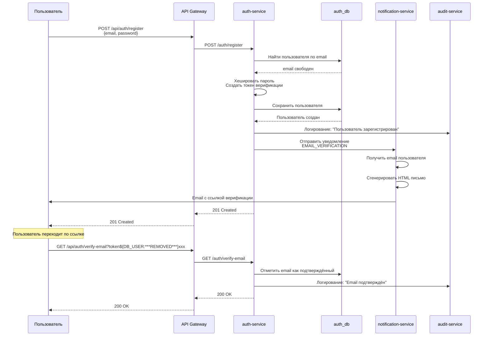
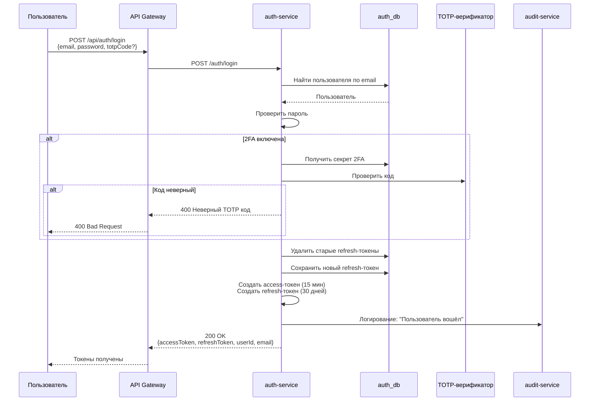
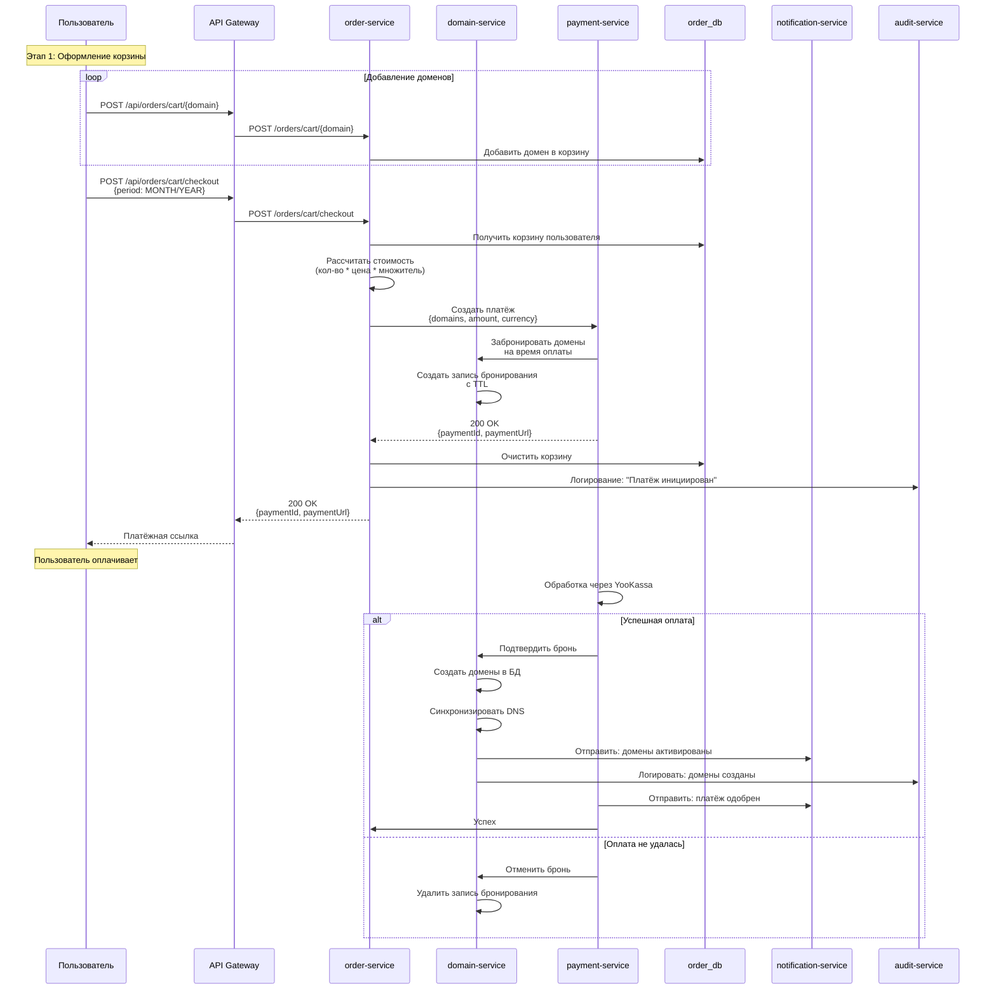
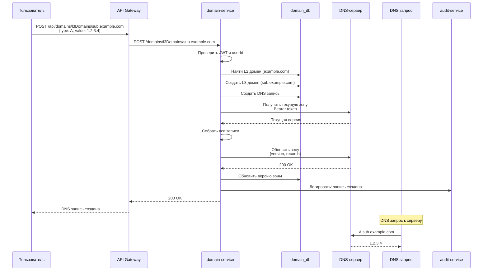
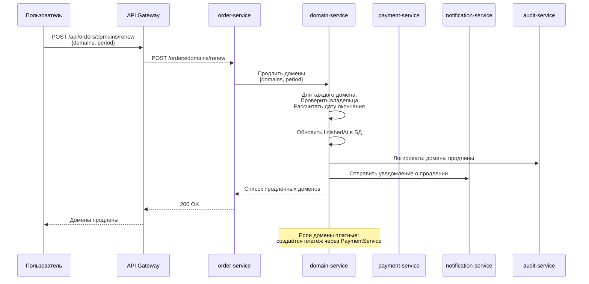
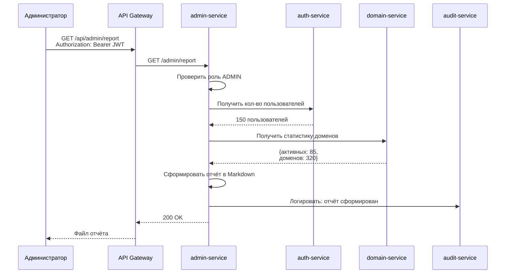
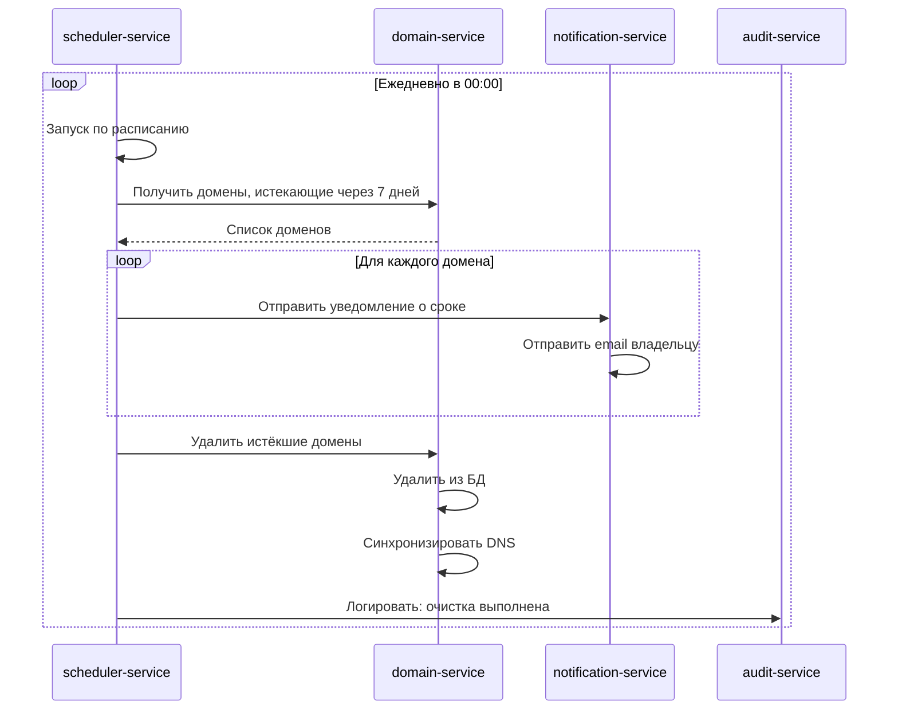
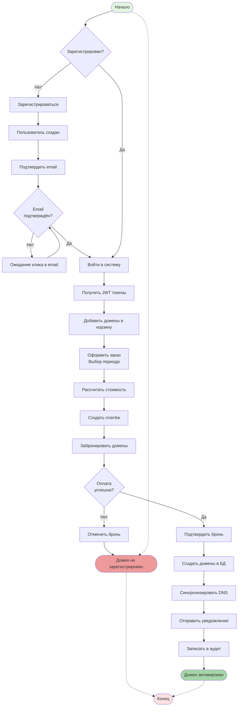
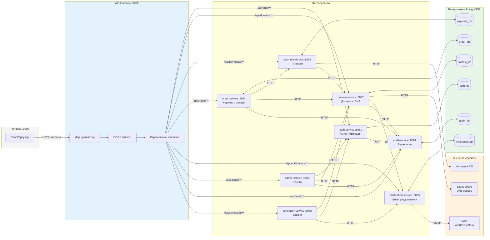
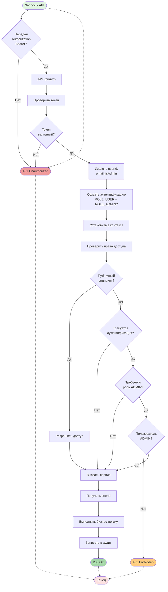

# Hrofos domain register

Микросервисная система регистрации доменов и управления DNS.

## Описание

Hrofos domain register — это распределённая система из микросервисов для регистрации доменов, управления DNS записями, обработки платежей и отправки уведомлений. Система построена на архитектуре Spring Boot с использованием PostgreSQL баз данных, React фронтенда и собственного Elixir DNS сервера.

## Основные функции

- Регистрация и аутентификация пользователей с JWT токенами
- Двухфакторная аутентификация (TOTP, Google Authenticator)
- Управление L2 и L3 доменами
- Управление DNS записями (A, AAAA, NS, MX, TXT, CNAME, SOA)
- Корзина доменов и оформление заказов
- Интеграция с платёжной системой YooKassa
- Отправка email-уведомлений
- Административные отчёты
- Аудит всех действий пользователей
- Планировщик задач для истекающих доменов

## Технологический стек

### Backend (Java)
- **Java 17**
- **Spring Boot 3.2.0**
- **Spring Security** — JWT аутентификация
- **Spring Cloud Gateway** — API Gateway
- **Spring Data JPA** — работа с данными
- **PostgreSQL** — базы данных для каждого сервиса
- **Liquibase** — миграции баз данных
- **JJWT 0.12.3** — создание и валидация JWT
- **TOTP 1.7.1** — двухфакторная аутентификация
- **OpenAPI Generator** — генерация API из YAML
- **SpringDoc OpenAPI** — Swagger UI

### Frontend
- **React 19**
- **TypeScript**
- **Rsbuild** (Vite альтернатива)
- **Chakra UI v3** + **Emotion**
- **MobX** — управление состоянием
- **react-router** — навигация
- **Orval** — генерация API клиентов из OpenAPI

### DNS Server
- **Elixir 1.18**
- **Bandit** — HTTP сервер
- **libcluster** — кластеризация узлов


### Сервисы

| Сервис | Порт | Описание |
|--------|------|----------|
| frontend | 3000 | React клиентское приложение |
| api-gateway | 8080 | Единая точка входа, маршрутизация |
| auth-service | 8081 | Аутентификация, пользователи, 2FA |
| domain-service | 8082 | Управление доменами и DNS |
| payment-service | 8083 | Обработка платежей (YooKassa) |
| order-service | 8084 | Корзина и оформление заказов |
| notification-service | 8085 | Отправка email уведомлений |
| admin-service | 8086 | Административные отчёты |
| audit-service | 8087 | Аудит действий пользователей |
| scheduler-service | 8088 | Планировщик задач |
| exdns (HTTP) | 8000 | HTTP API DNS сервера |
| exdns (DNS) | 5353 | UDP/TCP DNS сервер |

## Диаграммы

### Sequence Diagram — Регистрация пользователя и верификация email



### Sequence Diagram — Вход в систему с 2FA



### Sequence Diagram — Оформление заказа на домены



### Sequence Diagram — Управление DNS записями



### Sequence Diagram — Продление домена



### Sequence Diagram — Генерация административного отчёта



### Sequence Diagram — Планировщик истекающих доменов



### BPMN Diagram — Полный флоу регистрации домена



### BPMN Diagram — Поток запроса через API Gateway



### BPMN Diagram — Аутентификация и авторизация



### BPMN Diagram — Жизненный цикл домена

```mermaid
flowchart TD
    Start([Свободен]) --> InCart[В корзине<br/>order-service]

    InCart --> Checkout[Оформление заказа]
    Checkout --> Reserved[Забронирован<br/>domain-service<br/>TTL: 15 мин]

    Reserved --> Payment{Оплата<br/>успешна?}

    Payment -- Да --> Active[Активен<br/>userId, activatedAt,<br/>finishedAt]
    Payment -- Нет --> Cancel[Отмена брони]
    Cancel --> Start

    Active --> Renew{Пользователь<br/>продлевает?}
    Renew -- Да --> Renewed[Продлён<br/>finishedAt +${DB_USER:***REMOVED***} period]
    Renewed --> Active

    Active --> Expiring{Истекает<br/>через 7 дней?}
    Expiring -- Да --> Reminder[Напоминание<br/>notification-service]
    Reminder --> RenewCheck{Продлён до<br/>истечения?}

    RenewCheck -- Да --> Active
    RenewCheck -- Нет --> Expired[Истёк<br/>finishedAt < now]

    Expired --> Cleanup[Удалить<br/>scheduler-service]
    Cleanup --> Start

    Active --> Delete{Админ<br/>удаляет?}
    Delete -- Да --> Deleted[Удалён]
    Deleted --> End([Конец])

    Start -.-> End

    style Start fill:#a5d6a7
    style Active fill:#81c784
    style Reserved fill:#fff59d
    style Expired fill:#ef9a9a
    style Deleted fill:#b0bec5
    style End fill:#fce1e1
```

## JWT Токены

### Типы токенов

| Тип | Срок действия | Хранение | Назначение |
|-----|---------------|----------|------------|
| Access Token | 15 минут | Клиент (localStorage/cookie) | Доступ к защищённым эндпоинтам |
| Refresh Token | 30 дней | База данных (refresh_token) | Получение нового access token |

### Payload Access Token

```json
{
  "sub": "550e8400-e29b-41d4-a716-446655440000",
  "email": "user@example.com",
  "isAdmin": false,
  "type": "access",
  "iat": 1234567890,
  "exp": 1234568790
}
```

## Базы данных

Каждый сервис имеет собственную PostgreSQL базу данных:

| Сервис | База данных |
|--------|-------------|
| auth-service | auth_db |
| domain-service | domain_db |
| payment-service | payment_db |
| order-service | order_db |
| notification-service | notification_db |
| audit-service | audit_db |

Миграции управляются через Liquibase и применяются автоматически при запуске.

## Аудит

Сервисы отправляют события аудита в `audit-service` через `AuditClient` (fail-silent):
- `"User registered: {email}"` — при регистрации
- `"User logged in"` — при входе
- `"Email verified"` — при верификации email
- `"Domains created"` — при создании доменов
- `"Payment initiated: {paymentId}"` — при инициации платежа
- `"Admin report generated"` — при генерации отчёта

## Типы уведомлений

| Тип | Описание |
|-----|----------|
| ORDER_CREATED | Создание заказа |
| PAYMENT_APPROVED | Успешная оплата |
| DOMAIN_ACTIVATED | Активация домена |
| DOMAIN_EXPIRING_SOON | Истечение срока (напоминание) |
| DOMAIN_EXPIRED | Истечение срока |
| DOMAIN_RENEWED | Продление домена |
| EMAIL_VERIFICATION | Верификация email |

## Мониторинг

Все сервисы предоставляют Actuator эндпоинты:
- `/actuator/health` — состояние сервиса
- `/actuator/info` — информация о сервисе
- `/actuator/metrics` — метрики приложения

## Swagger UI

Документация API каждого сервиса доступна:
- auth-service: `http://localhost:8081/swagger-ui.html`
- domain-service: `http://localhost:8082/swagger-ui.html`
- и т.д.

## Логика доступа

### Роли пользователей

- **ROLE_USER** — все аутентифицированные пользователи
- **ROLE_ADMIN** — администраторы (доступ к административным эндпоинтам)

### Правила доступа

- Публичные эндпоинты (без токена): регистрация, login, verify email, Swagger UI
- Аутентифицированные: защищённые эндпоинты для авторизованных пользователей
- ADMIN: статистика, отчёты, управление L2 доменами

### Владение ресурсами

- Пользователи могут управлять только своими доменами и DNS записями
- Администраторы могут управлять любыми ресурсами
- Проверка владельца выполняется на уровне сервисов
