# Hrofos domain register

Микросервисная система регистрации доменов и управления DNS.

## Описание

Hrofos domain register — это распределённая система из микросервисов для регистрации доменов, управления DNS записями, обработки платежей и отправки уведомлений. Система построена на архитектуре Spring Boot с использованием PostgreSQL баз данных, React фронтенда и собственного Elixir DNS сервера.

## Основные функции

- Регистрация и аутентификация пользователей с JWT токенами
- Двухфакторная аутентификация (TOTP, Google Authenticator)
- Управление L2 и L3 доменами
- Управление DNS записями (A, AAAA, NS, MX, TXT, CNAME, SOA)
- Корзина доменов и оформление заказов
- Интеграция с платёжной системой YooKassa
- Отправка email-уведомлений
- Административные отчёты
- Аудит всех действий пользователей
- Планировщик задач для истекающих доменов

## Технологический стек

### Backend (Java)
- **Java 17**
- **Spring Boot 3.2.0**
- **Spring Security** — JWT аутентификация
- **Spring Cloud Gateway** — API Gateway
- **Spring Data JPA** — работа с данными
- **PostgreSQL** — базы данных для каждого сервиса
- **Liquibase** — миграции баз данных
- **JJWT 0.12.3** — создание и валидация JWT
- **TOTP 1.7.1** — двухфакторная аутентификация
- **OpenAPI Generator** — генерация API из YAML
- **SpringDoc OpenAPI** — Swagger UI

### Frontend
- **React 19**
- **TypeScript**
- **Rsbuild** (Vite альтернатива)
- **Chakra UI v3** + **Emotion**
- **MobX** — управление состоянием
- **react-router** — навигация
- **Orval** — генерация API клиентов из OpenAPI

### DNS Server
- **Elixir 1.18**
- **Bandit** — HTTP сервер
- **libcluster** — кластеризация узлов


### Сервисы

| Сервис               | Порт | Описание                          |
|----------------------|------|-----------------------------------|
| frontend             | 3000 | React клиентское приложение       |
| api-gateway          | 8080 | Единая точка входа, маршрутизация |
| auth-service         | 8081 | Аутентификация, пользователи, 2FA |
| domain-service       | 8082 | Управление доменами и DNS         |
| payment-service      | 8083 | Обработка платежей (YooKassa)     |
| order-service        | 8084 | Корзина и оформление заказов      |
| notification-service | 8085 | Отправка email уведомлений        |
| admin-service        | 8086 | Административные отчёты           |
| audit-service        | 8087 | Аудит действий пользователей      |
| scheduler-service    | 8088 | Планировщик задач                 |
| exdns (HTTP)         | 8000 | HTTP API DNS сервера              |
| exdns (DNS)          | 5353 | UDP/TCP DNS сервер                |

## Диаграммы

### Sequence Diagram — Регистрация пользователя и верификация email

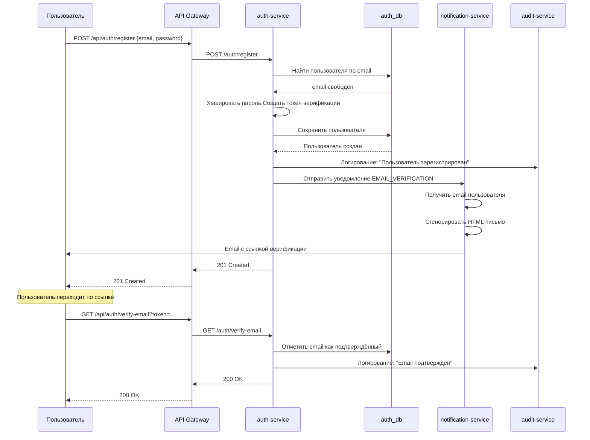
```mermaid
sequenceDiagram
    participant U as Пользователь
    participant GW as API Gateway
    participant Auth as auth-service
    participant DB as auth_db
    participant Notif as notification-service
    participant Audit as audit-service

    U->>GW: POST /api/auth/register {email, password}
    GW->>Auth: POST /auth/register

    Auth->>DB: Найти пользователя по email
    DB-->>Auth: email свободен

    Auth->>Auth: Хешировать пароль Создать токен верификации

    Auth->>DB: Сохранить пользователя
    DB-->>Auth: Пользователь создан

    Auth->>Audit: Логирование: "Пользователь зарегистрирован"
    Auth->>Notif: Отправить уведомление EMAIL_VERIFICATION

    Notif->>Notif: Получить email пользователя
    Notif->>Notif: Сгенерировать HTML письмо
    Notif->>U: Email с ссылкой верификации

    Auth-->>GW: 201 Created
    GW-->>U: 201 Created

    Note over U: Пользователь переходит по ссылке

    U->>GW: GET /api/auth/verify-email?token=...
    GW->>Auth: GET /auth/verify-email

    Auth->>DB: Отметить email как подтверждённый
    Auth->>Audit: Логирование: "Email подтверждён"

    Auth-->>GW: 200 OK
    GW-->>U: 200 OK
```

### Sequence Diagram — Вход в систему с 2FA

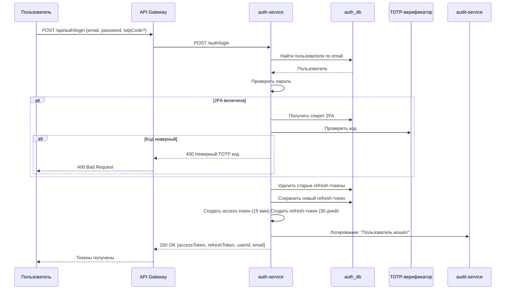
```mermaid
sequenceDiagram
    participant U as Пользователь
    participant GW as API Gateway
    participant Auth as auth-service
    participant DB as auth_db
    participant TOTP as TOTP-верификатор
    participant Audit as audit-service

    U->>GW: POST /api/auth/login {email, password, totpCode?}
    GW->>Auth: POST /auth/login

    Auth->>DB: Найти пользователя по email
    DB-->>Auth: Пользователь

    Auth->>Auth: Проверить пароль

    alt 2FA включена
        Auth->>DB: Получить секрет 2FA
        Auth->>TOTP: Проверить код

        alt Код неверный
            Auth-->>GW: 400 Неверный TOTP код
            GW-->>U: 400 Bad Request
        end
    end

    Auth->>DB: Удалить старые refresh-токены
    Auth->>DB: Сохранить новый refresh-токен

    Auth->>Auth: Создать access-токен (15 мин) Создать refresh-токен (30 дней)

    Auth->>Audit: Логирование: "Пользователь вошёл"

    Auth-->>GW: 200 OK {accessToken, refreshToken, userId, email}
    GW-->>U: Токены получены
```

### Sequence Diagram — Оформление заказа на домены

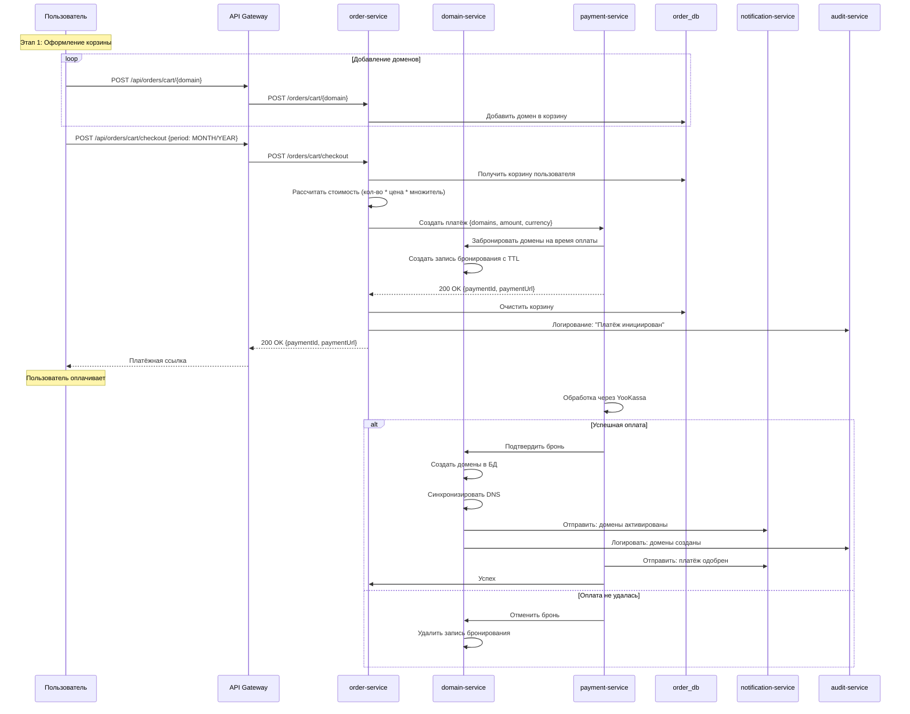
```mermaid
sequenceDiagram
    participant U as Пользователь
    participant GW as API Gateway
    participant Order as order-service
    participant Domain as domain-service
    participant Payment as payment-service
    participant DB as order_db
    participant Notif as notification-service
    participant Audit as audit-service

    Note over U: Этап 1: Оформление корзины

    loop Добавление доменов
        U->>GW: POST /api/orders/cart/{domain}
        GW->>Order: POST /orders/cart/{domain}
        Order->>DB: Добавить домен в корзину
    end

    U->>GW: POST /api/orders/cart/checkout {period: MONTH/YEAR}
    GW->>Order: POST /orders/cart/checkout

    Order->>DB: Получить корзину пользователя
    Order->>Order: Рассчитать стоимость (кол-во * цена * множитель)

    Order->>Payment: Создать платёж {domains, amount, currency}
    Payment->>Domain: Забронировать домены на время оплаты
    Domain->>Domain: Создать запись бронирования с TTL

    Payment-->>Order: 200 OK {paymentId, paymentUrl}

    Order->>DB: Очистить корзину
    Order->>Audit: Логирование: "Платёж инициирован"

    Order-->>GW: 200 OK {paymentId, paymentUrl}
    GW-->>U: Платёжная ссылка

    Note over U: Пользователь оплачивает

    Payment->>Payment: Обработка через YooKassa

    alt Успешная оплата
        Payment->>Domain: Подтвердить бронь
        Domain->>Domain: Создать домены в БД
        Domain->>Domain: Синхронизировать DNS
        Domain->>Notif: Отправить: домены активированы
        Domain->>Audit: Логировать: домены созданы

        Payment->>Notif: Отправить: платёж одобрен
        Payment->>Order: Успех
    else Оплата не удалась
        Payment->>Domain: Отменить бронь
        Domain->>Domain: Удалить запись бронирования
    end
```

### Sequence Diagram — Управление DNS записями

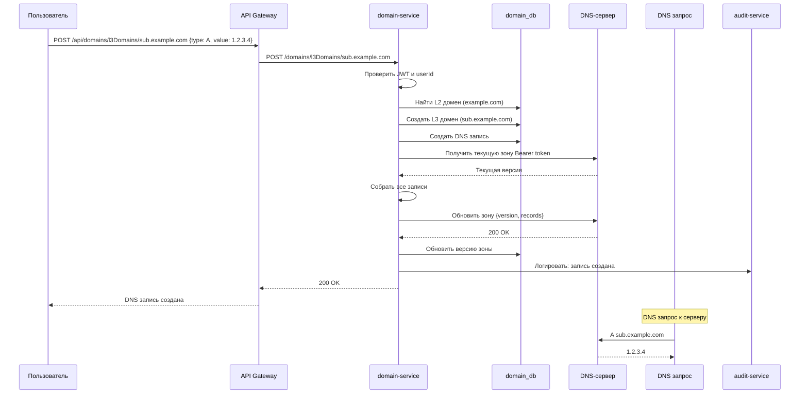
```mermaid
sequenceDiagram
    participant U as Пользователь
    participant GW as API Gateway
    participant Domain as domain-service
    participant DB as domain_db
    participant Dns as DNS-сервер
    participant Query as DNS запрос
    participant Audit as audit-service

    U->>GW: POST /api/domains/l3Domains/sub.example.com {type: A, value: 1.2.3.4}
    GW->>Domain: POST /domains/l3Domains/sub.example.com

    Domain->>Domain: Проверить JWT и userId
    Domain->>DB: Найти L2 домен (example.com)
    Domain->>DB: Создать L3 домен (sub.example.com)
    Domain->>DB: Создать DNS запись

    Domain->>Dns: Получить текущую зону Bearer token
    Dns-->>Domain: Текущая версия

    Domain->>Domain: Собрать все записи
    Domain->>Dns: Обновить зону {version, records}
    Dns-->>Domain: 200 OK

    Domain->>DB: Обновить версию зоны

    Domain->>Audit: Логировать: запись создана

    Domain-->>GW: 200 OK
    GW-->>U: DNS запись создана

    Note over Query: DNS запрос к серверу
    Query->>Dns: A sub.example.com
    Dns-->>Query: 1.2.3.4
```

### Sequence Diagram — Продление домена

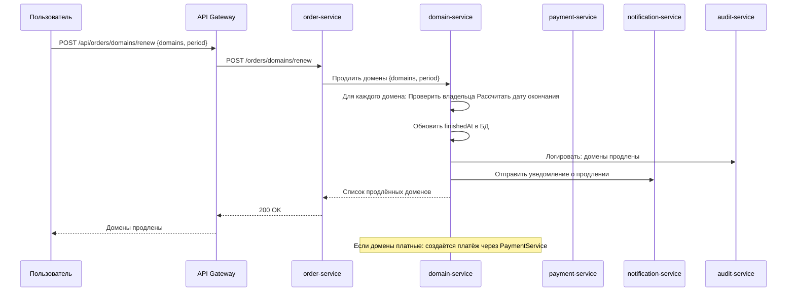
```mermaid
sequenceDiagram
    participant U as Пользователь
    participant GW as API Gateway
    participant Order as order-service
    participant Domain as domain-service
    participant Payment as payment-service
    participant Notif as notification-service
    participant Audit as audit-service

    U->>GW: POST /api/orders/domains/renew {domains, period}
    GW->>Order: POST /orders/domains/renew

    Order->>Domain: Продлить домены {domains, period}

    Domain->>Domain: Для каждого домена: Проверить владельца Рассчитать дату окончания

    Domain->>Domain: Обновить finishedAt в БД

    Domain->>Audit: Логировать: домены продлены
    Domain->>Notif: Отправить уведомление о продлении

    Domain-->>Order: Список продлённых доменов
    Order-->>GW: 200 OK
    GW-->>U: Домены продлены

    Note over Domain: Если домены платные: создаётся платёж через PaymentService
```

### Sequence Diagram — Генерация административного отчёта

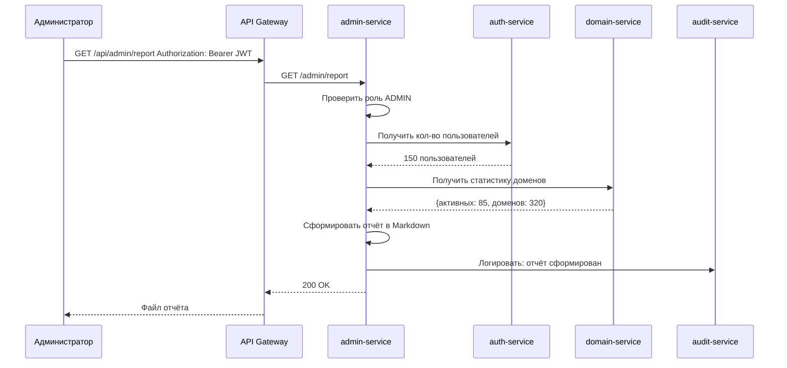
```mermaid
sequenceDiagram
    participant Admin as Администратор
    participant GW as API Gateway
    participant Svc as admin-service
    participant Auth as auth-service
    participant Domain as domain-service
    participant Audit as audit-service

    Admin->>GW: GET /api/admin/report Authorization: Bearer JWT
    GW->>Svc: GET /admin/report

    Svc->>Svc: Проверить роль ADMIN

    Svc->>Auth: Получить кол-во пользователей
    Auth-->>Svc: 150 пользователей

    Svc->>Domain: Получить статистику доменов
    Domain-->>Svc: {активных: 85, доменов: 320}

    Svc->>Svc: Сформировать отчёт в Markdown

    Svc->>Audit: Логировать: отчёт сформирован

    Svc-->>GW: 200 OK
    GW-->>Admin: Файл отчёта
```

### Sequence Diagram — Планировщик истекающих доменов

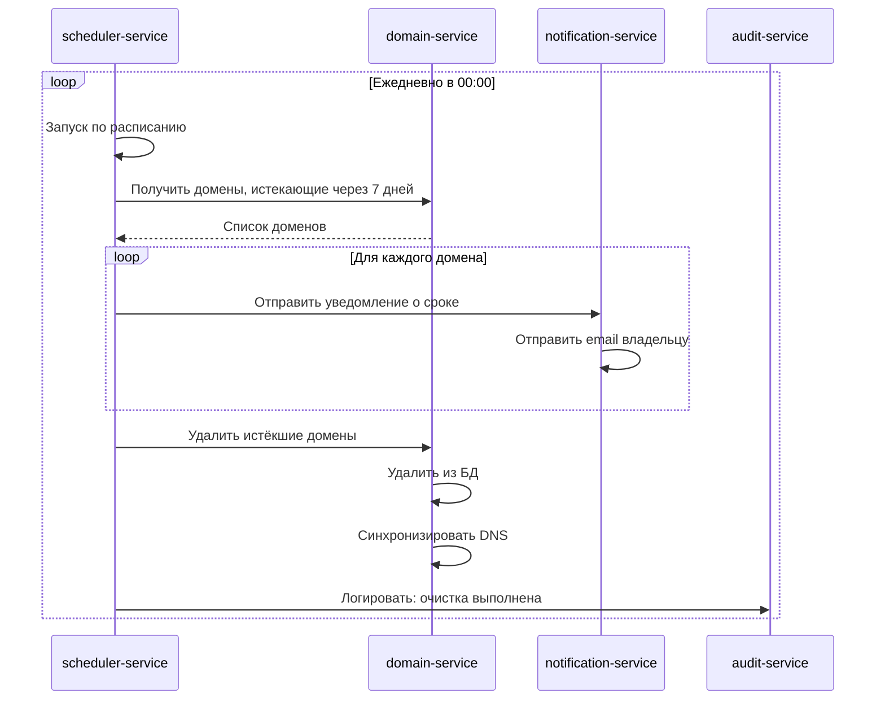
```mermaid
sequenceDiagram
    participant Sch as scheduler-service
    participant Domain as domain-service
    participant Notif as notification-service
    participant Audit as audit-service

    loop Ежедневно в 00:00
        Sch->>Sch: Запуск по расписанию

        Sch->>Domain: Получить домены, истекающие через 7 дней
        Domain-->>Sch: Список доменов

        loop Для каждого домена
            Sch->>Notif: Отправить уведомление о сроке
            Notif->>Notif: Отправить email владельцу
        end

        Sch->>Domain: Удалить истёкшие домены
        Domain->>Domain: Удалить из БД
        Domain->>Domain: Синхронизировать DNS

        Sch->>Audit: Логировать: очистка выполнена
    end
```

### BPMN Diagram — Полный флоу регистрации домена

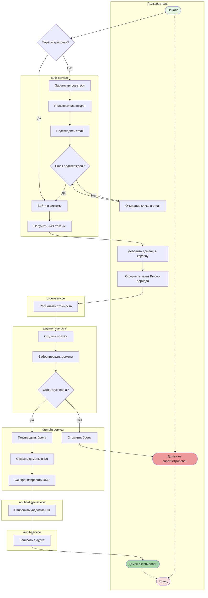
```mermaid
flowchart TB
    subgraph UserLane["         Пользователь"]
        Start([Начало])
        WaitVerify[Ожидание клика в email]
        AddToCart[Добавить домены в корзину]
        Checkout[Оформить заказ Выбор периода]
        Success([Домен активирован])
        Fail([Домен не зарегистрирован])
        End([Конец])
    end

    subgraph AuthLane["         auth-service"]
        Register[Зарегистрироваться]
        RegSuccess[Пользователь создан]
        VerifyEmail[Подтвердить email]
        EmailVerified{Email подтверждён?}
        Login[Войти в систему]
        GetToken[Получить JWT токены]
    end

    subgraph OrderLane["         order-service"]
        Calculate[Рассчитать стоимость]
    end

    subgraph PaymentLane["         payment-service"]
        CreatePayment[Создать платёж]
        Reserve[Забронировать домены]
        UserPay{Оплата успешна?}
    end

    subgraph DomainLane["         domain-service"]
        Confirm[Подтвердить бронь]
        CreateDomains[Создать домены в БД]
        SyncDNS[Синхронизировать DNS]
        CancelReserve[Отменить бронь]
    end

    subgraph NotifLane["         notification-service"]
        Notify[Отправить уведомления]
    end

    subgraph AuditLane["         audit-service"]
        AuditLog[Записать в аудит]
    end

    Start --> RegOrLogin{Зарегистрирован?}

    RegOrLogin -- Нет --> Register
    Register --> RegSuccess
    RegSuccess --> VerifyEmail
    VerifyEmail --> EmailVerified

    EmailVerified -- Нет --> WaitVerify
    WaitVerify --> EmailVerified

    EmailVerified -- Да --> Login
    RegOrLogin -- Да --> Login

    Login --> GetToken
    GetToken --> AddToCart

    AddToCart --> Checkout
    Checkout --> Calculate
    Calculate --> CreatePayment
    CreatePayment --> Reserve

    Reserve --> UserPay

    UserPay -- Да --> Confirm
    Confirm --> CreateDomains
    CreateDomains --> SyncDNS

    SyncDNS --> Notify
    Notify --> AuditLog

    AuditLog --> Success

    UserPay -- Нет --> CancelReserve
    CancelReserve --> Fail

    Start -.-> Fail
    Fail -.-> End
    Success -.-> End

    style Start fill:#e1f5e1
    style End fill:#fce1e1
    style Success fill:#a5d6a7
    style Fail fill:#ef9a9a
```

### BPMN Diagram — Поток запроса через API Gateway

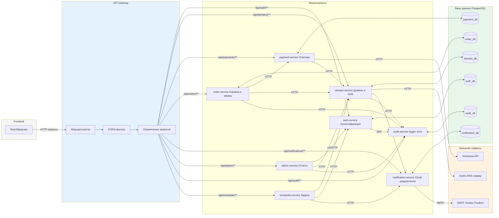
```mermaid
flowchart LR
    subgraph FrontendLane["         Frontend"]
        Client[React/браузер]
    end

    subgraph GatewayLane["         API Gateway"]
        Router[Маршрутизатор]
        Cors[CORS фильтр]
        RLim[Ограничение запросов]
    end

    subgraph ServicesLane["         Микросервисы"]
        Auth[auth-service Аутентификация]
        Domain[domain-service Домены и DNS]
        Payment[payment-service Платежи]
        Order[order-service Корзина и заказы]
        Notif[notification-service Email уведомления]
        Admin[admin-service Отчёты]
        Audit[audit-service Аудит логи]
        Scheduler[scheduler-service Задачи]
    end

    subgraph ExternalLane["         Внешние сервисы"]
        Exdns[exdns DNS сервер]
        SMTP[SMTP Yandex Postbox]
        YooKassa[YooKassa API]
    end

    subgraph DBLane["         Базы данных PostgreSQL"]
        AuthDB[(auth_db)]
        DomainDB[(domain_db)]
        PaymentDB[(payment_db)]
        OrderDB[(order_db)]
        NotifDB[(notification_db)]
        AuditDB[(audit_db)]
    end

    Client -->|HTTP запросы| Router
    Router --> Cors
    Cors --> RLim

    RLim -->|/api/auth/**| Auth
    RLim -->|/api/domains/**| Domain
    RLim -->|/api/payments/**| Payment
    RLim -->|/api/orders/**| Order
    RLim -->|/api/notifications/**| Notif
    RLim -->|/api/admin/**| Admin
    RLim -->|/api/audit/**| Audit
    RLim -->|/api/scheduler/**| Scheduler

    Auth <--> AuthDB
    Auth -->|JWT| Audit

    Domain <--> DomainDB
    Domain -->|HTTP| Exdns
    Domain -->|HTTP| Notif
    Domain -->|HTTP| Audit

    Payment <--> PaymentDB
    Payment -->|HTTP| YooKassa
    Payment -->|HTTP| Domain

    Order <--> OrderDB
    Order -->|HTTP| Payment
    Order -->|HTTP| Domain
    Order -->|HTTP| Audit

    Notif <--> NotifDB
    Notif -->|SMTP| SMTP

    Admin -->|HTTP| Auth
    Admin -->|HTTP| Domain
    Admin -->|HTTP| Audit

    Scheduler -->|HTTP| Domain
    Scheduler -->|HTTP| Auth
    Scheduler -->|HTTP| Notif

    Audit <--> AuditDB

    style GatewayLane fill:#e3f2fd
    style FrontendLane fill:#f5f5f5
    style ExternalLane fill:#fff3e0
    style DBLane fill:#e8f5e9
```

### BPMN Diagram — Аутентификация и авторизация

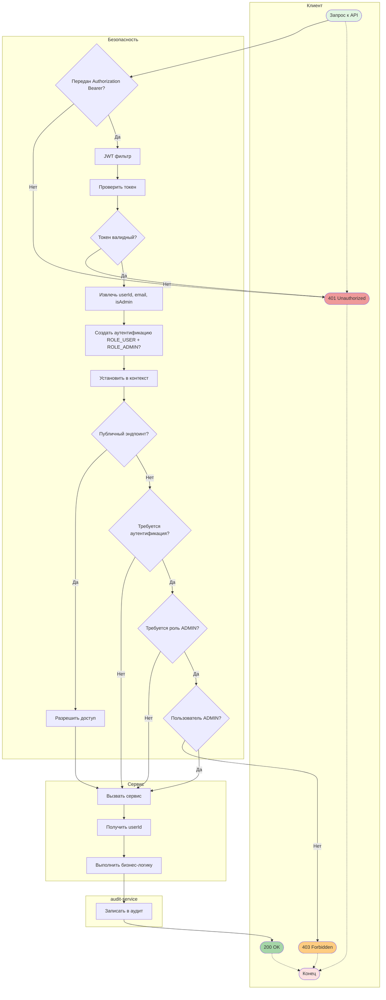
```mermaid
flowchart TB
    subgraph ClientLane["         Клиент"]
        Start([Запрос к API])
        Return401([401 Unauthorized])
        Return403([403 Forbidden])
        Return200([200 OK])
        End([Конец])
    end

    subgraph SecurityLane["         Безопасность"]
        HasToken{Передан Authorization Bearer?}
        JwtFilter[JWT фильтр]
        Validate[Проверить токен]
        IsValid{Токен валидный?}
        ExtractClaims[Извлечь userId, email, isAdmin]
        CreateAuth[Создать аутентификацию ROLE_USER + ROLE_ADMIN?]
        SecurityCtx[Установить в контекст]
        IsPublic{Публичный эндпоинт?}
        IsAuthenticated{Требуется аутентификация?}
        HasAdmin{Требуется роль ADMIN?}
        CheckAdmin{Пользователь ADMIN?}
        PassFilter[Разрешить доступ]
    end

    subgraph ServiceLane["         Сервис"]
        Service[Вызвать сервис]
        GetUserId[Получить userId]
        BusinessLogic[Выполнить бизнес-логику]
    end

    subgraph AuditLane["         audit-service"]
        AuditLog[Записать в аудит]
    end

    Start --> HasToken

    HasToken -- Нет --> Return401
    HasToken -- Да --> JwtFilter

    JwtFilter --> Validate
    Validate --> IsValid
    IsValid -- Нет --> Return401
    IsValid -- Да --> ExtractClaims

    ExtractClaims --> CreateAuth
    CreateAuth --> SecurityCtx

    SecurityCtx --> IsPublic

    IsPublic -- Да --> PassFilter
    PassFilter --> Service

    IsPublic -- Нет --> IsAuthenticated

    IsAuthenticated -- Нет --> Service
    IsAuthenticated -- Да --> HasAdmin

    HasAdmin -- Нет --> Service
    HasAdmin -- Да --> CheckAdmin

    CheckAdmin -- Нет --> Return403
    CheckAdmin -- Да --> Service

    Service --> GetUserId
    GetUserId --> BusinessLogic
    BusinessLogic --> AuditLog

    AuditLog --> Return200

    Start -.-> Return401
    Return401 -.-> End
    Return403 -.-> End
    Return200 -.-> End

    style Start fill:#e1f5e1
    style End fill:#fce1e1
    style Return200 fill:#a5d6a7
    style Return401 fill:#ef9a9a
    style Return403 fill:#ffcc80
```

### BPMN Diagram — Жизненный цикл домена

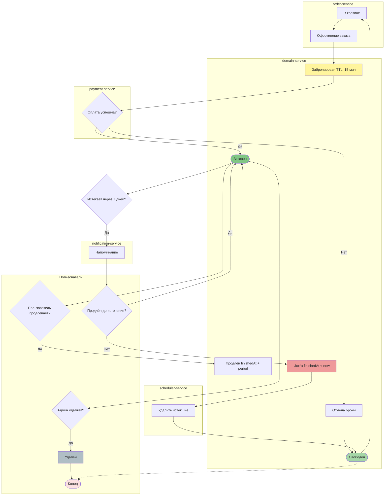
```mermaid
flowchart TB
    subgraph OrderLane["         order-service"]
        InCart[В корзине]
        Checkout[Оформление заказа]
    end

    subgraph DomainLane["         domain-service"]
        Start([Свободен])
        Cancel[Отмена брони]
        Active([Активен])
        Reserved[Забронирован TTL: 15 мин]
        Renewed[Продлён finishedAt + period]
        Expired[Истёк finishedAt < now]
    end

    subgraph PaymentLane["         payment-service"]
        Payment{Оплата успешна?}
    end

    subgraph NotifLane["         notification-service"]
        Reminder[Напоминание]
    end

    subgraph SchedulerLane["         scheduler-service"]
        Cleanup[Удалить истёкшие]
    end

    subgraph UserLane["         Пользователь"]
    Renew{Пользователь продлевает?}
    RenewCheck{Продлён до истечения?}
        Delete{Админ удаляет?}
        Deleted[Удалён]
        End([Конец])
    end

    Start --> InCart
    InCart --> Checkout
    Checkout --> Reserved

    Reserved --> Payment

    Payment -- Да --> Active
    Payment -- Нет --> Cancel
    Cancel --> Start

    Active --> Renew

    Renew -- Да --> Renewed
    Renewed --> Active

    Active --> Expiring{Истекает через 7 дней?}

    Expiring -- Да --> Reminder
    Reminder --> RenewCheck

    RenewCheck -- Да --> Active
    RenewCheck -- Нет --> Expired

    Expired --> Cleanup
    Cleanup --> Start

    Active --> Delete
    Delete -- Да --> Deleted
    Deleted --> End

    Start -.-> End

    style Start fill:#a5d6a7
    style Active fill:#81c784
    style Reserved fill:#fff59d
    style Expired fill:#ef9a9a
    style Deleted fill:#b0bec5
    style End fill:#fce1e1
```

#### Class Diagram

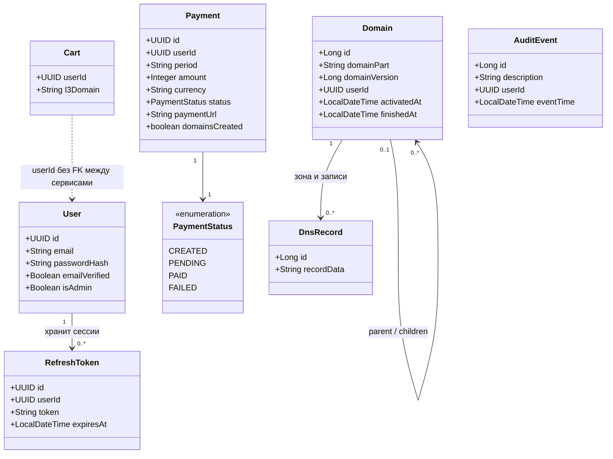
```mermaid
classDiagram
    direction TB

    class User {
        +UUID id
        +String email
        +String passwordHash
        +Boolean emailVerified
        +Boolean isAdmin
    }

    class RefreshToken {
        +UUID id
        +UUID userId
        +String token
        +LocalDateTime expiresAt
    }

    class Cart {
        +UUID userId
        +String l3Domain
    }

    class Domain {
        +Long id
        +String domainPart
        +Long domainVersion
        +UUID userId
        +LocalDateTime activatedAt
        +LocalDateTime finishedAt
    }

    class DnsRecord {
        +Long id
        +String recordData
    }

    class Payment {
        +UUID id
        +UUID userId
        +String period
        +Integer amount
        +String currency
        +PaymentStatus status
        +String paymentUrl
        +boolean domainsCreated
    }

    class PaymentStatus {
        <<enumeration>>
        CREATED
        PENDING
        PAID
        FAILED
    }

    class AuditEvent {
        +Long id
        +String description
        +UUID userId
        +LocalDateTime eventTime
    }

    User "1" --> "0..*" RefreshToken : хранит сессии
    Domain "1" --> "0..*" DnsRecord : зона и записи
    Domain "0..1" --> "0..*" Domain : parent / children
    Payment "1" --> "1" PaymentStatus
    Cart ..> User : userId без FK между сервисами
```

#### Object Diagram

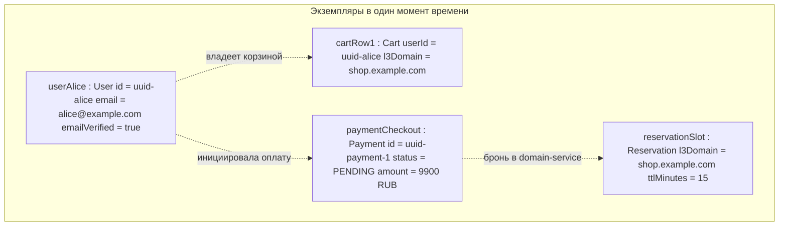
```mermaid
flowchart TB
    subgraph objects["Экземпляры в один момент времени"]
        o1["userAlice : User id = uuid-alice email = alice@example.com emailVerified = true"]
        o2["cartRow1 : Cart userId = uuid-alice l3Domain = shop.example.com"]
        o3["paymentCheckout : Payment id = uuid-payment-1 status = PENDING amount = 9900 RUB"]
        o4["reservationSlot : Reservation l3Domain = shop.example.com ttlMinutes = 15"]
    end

    o1 -.->|владеет корзиной| o2
    o1 -.->|инициировала оплату| o3
    o3 -.->|бронь в domain-service| o4
```

#### Deployment Diagram

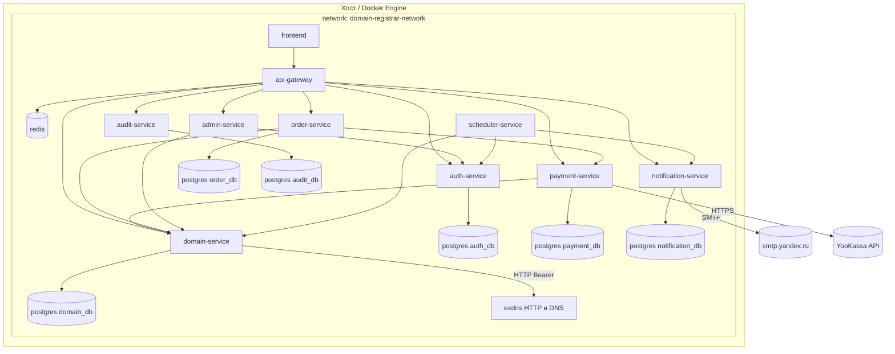
```mermaid
flowchart TB
    subgraph host["Хост / Docker Engine"]
        subgraph net["network: domain-registrar-network"]
            FE[frontend]
            GW[api-gateway]
            RD[(redis)]

            AS[auth-service]
            DS[domain-service]
            PS[payment-service]
            OS[order-service]
            NS[notification-service]
            AD[admin-service]
            AU[audit-service]
            SCH[scheduler-service]

            PG_A[(postgres auth_db)]
            PG_D[(postgres domain_db)]
            PG_P[(postgres payment_db)]
            PG_O[(postgres order_db)]
            PG_N[(postgres notification_db)]
            PG_U[(postgres audit_db)]

            EX[exdns HTTP и DNS]
        end
    end

    FE --> GW
    GW --> RD
    GW --> AS & DS & PS & OS & NS & AD & AU

    AS --> PG_A
    DS --> PG_D
    PS --> PG_P
    OS --> PG_O
    NS --> PG_N
    AU --> PG_U

    DS -->|HTTP Bearer| EX
    NS -->|SMTP| SMTP[(smtp.yandex.ru)]
    PS -->|HTTPS| YK[(YooKassa API)]
    PS --> DS
    OS --> DS
    OS --> PS
    AD --> AS
    AD --> DS
    SCH --> DS
    SCH --> AS
    SCH --> NS
```

#### Composite Structure Diagram

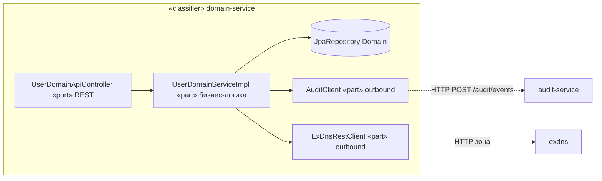
```mermaid
flowchart LR
    subgraph DomainService["«classifier» domain-service"]
        direction TB
        UC[UserDomainApiController «port» REST]
        SVC[UserDomainServiceImpl «part» бизнес-логика]
        REPO[(JpaRepository Domain)]
        AUD[AuditClient «part» outbound]
        DNS[ExDnsRestClient «part» outbound]
        UC --> SVC
        SVC --> REPO
        SVC --> AUD
        SVC --> DNS
    end

    AUD -.->|HTTP POST /audit/events| AuditSvc[audit-service]
    DNS -.->|HTTP зона| Exdns[exdns]
```

#### Package Diagram

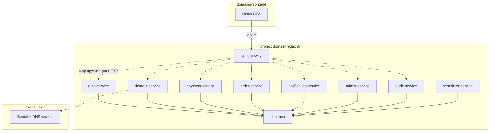
```mermaid
flowchart TB
    subgraph root["project domain-registrar"]
        GW_MOD[api-gateway]
        CM[common]
        AUTH[auth-service]
        DOM[domain-service]
        PAY[payment-service]
        ORD[order-service]
        NOTIF[notification-service]
        ADM[admin-service]
        AUD[audit-service]
        SCH[scheduler-service]
    end

    AUTH --> CM
    DOM --> CM
    PAY --> CM
    ORD --> CM
    NOTIF --> CM
    ADM --> CM
    AUD --> CM
    SCH --> CM
    GW_MOD -.->|маршрутизация HTTP| AUTH
    GW_MOD -.-> DOM
    GW_MOD -.-> PAY
    GW_MOD -.-> ORD
    GW_MOD -.-> NOTIF
    GW_MOD -.-> ADM
    GW_MOD -.-> AUD

    subgraph front["domains-frontend"]
        FE[React SPA]
    end

    FE -.->|/api/**| GW_MOD

    subgraph dns["exdns Elixir"]
        EX[Bandit + DNS worker]
    end

    DOM -.-> EX
```

#### Component Diagram

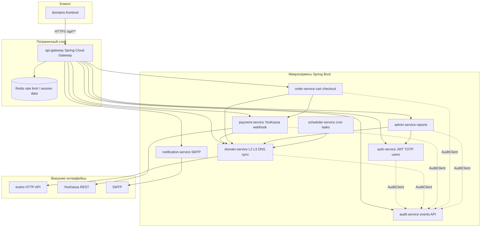
```mermaid
flowchart TB
    subgraph client_tier["Клиент"]
        UI[domains-frontend]
    end

    subgraph edge["Пограничный слой"]
        APIGW[api-gateway Spring Cloud Gateway]
        REDIS[(Redis rate limit / session data)]
    end

    subgraph core["Микросервисы Spring Boot"]
        AUTH_C[auth-service JWT TOTP users]
        DOM_C[domain-service L2 L3 DNS sync]
        PAY_C[payment-service YooKassa webhook]
        ORD_C[order-service cart checkout]
        NOT_C[notification-service SMTP]
        ADM_C[admin-service reports]
        AUD_C[audit-service events API]
        SCH_C[scheduler-service cron tasks]
    end

    subgraph external["Внешние интерфейсы"]
        EXDNS_I[exdns HTTP API]
        YK_I[YooKassa REST]
        SMTP_I[SMTP]
    end

    UI -->|HTTPS /api/**| APIGW
    APIGW --> REDIS
    APIGW --> AUTH_C
    APIGW --> DOM_C
    APIGW --> PAY_C
    APIGW --> ORD_C
    APIGW --> NOT_C
    APIGW --> ADM_C
    APIGW --> AUD_C

    DOM_C --> EXDNS_I
    PAY_C --> YK_I
    PAY_C --> DOM_C
    ORD_C --> PAY_C
    ORD_C --> DOM_C
    NOT_C --> SMTP_I
    ADM_C --> AUTH_C
    ADM_C --> DOM_C
    SCH_C --> DOM_C
    AUTH_C ..->|AuditClient| AUD_C
    DOM_C ..->|AuditClient| AUD_C
    PAY_C ..->|AuditClient| AUD_C
    ORD_C ..->|AuditClient| AUD_C
    ADM_C ..->|AuditClient| AUD_C
```

#### State Machine Diagram

Жизненный цикл `Payment` в `payment-service`.

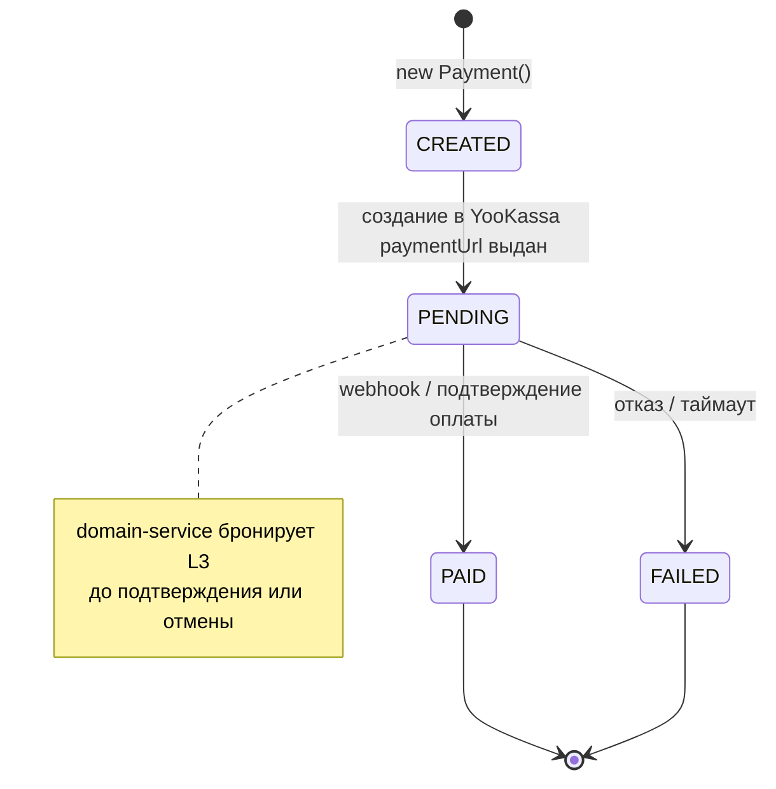
```mermaid
stateDiagram-v2
    [*] --> CREATED: new Payment()
    CREATED --> PENDING: создание в YooKassa paymentUrl выдан
    PENDING --> PAID: webhook / подтверждение оплаты
    PENDING --> FAILED: отказ / таймаут
    PAID --> [*]
    FAILED --> [*]

    note right of PENDING
        domain-service бронирует L3
        до подтверждения или отмены
    end note
```

#### Activity Diagram

Оформление заказа из `order-service`.

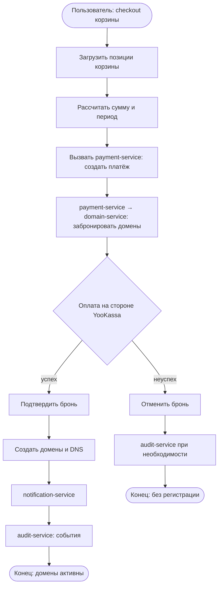
```mermaid
flowchart TB
    start([Пользователь: checkout корзины]) --> loadCart[Загрузить позиции корзины]
    loadCart --> calc[Рассчитать сумму и период]
    calc --> createPay[Вызвать payment-service: создать платёж]
    createPay --> reserve[payment-service → domain-service: забронировать домены]
    reserve --> fork{Оплата на стороне YooKassa}

    fork -->|успех| confirm[Подтвердить бронь]
    confirm --> persist[Создать домены и DNS]
    persist --> notify[notification-service]
    notify --> auditOk[audit-service: события]
    auditOk --> endOk([Конец: домены активны])

    fork -->|неуспех| cancel[Отменить бронь]
    cancel --> auditFail[audit-service при необходимости]
    auditFail --> endFail([Конец: без регистрации])
```

#### Use Case Diagram

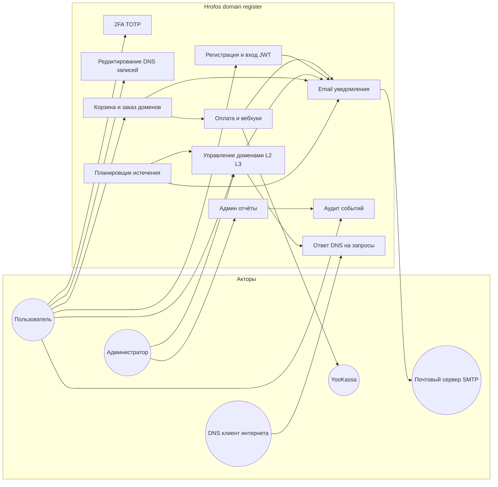
```mermaid
flowchart LR
    subgraph actors["Акторы"]
        U((Пользователь))
        A((Администратор))
        YK((YooKassa))
        M((Почтовый сервер SMTP))
        D((DNS клиент интернета))
    end

    subgraph system["Hrofos domain register"]
        UC1[Регистрация и вход JWT]
        UC2[2FA TOTP]
        UC3[Управление доменами L2 L3]
        UC4[Редактирование DNS записей]
        UC5[Корзина и заказ доменов]
        UC6[Оплата и вебхуки]
        UC7[Email уведомления]
        UC8[Админ отчёты]
        UC9[Аудит событий]
        UC10[Планировщик истечения]
        UC11[Ответ DNS на запросы]
    end

    U --> UC1
    U --> UC2
    U --> UC3
    U --> UC4
    U --> UC5
    UC5 --> UC6
    UC6 --> YK
    UC6 --> UC7
    UC1 --> UC7
    UC3 --> UC7
    UC5 --> UC7
    UC7 --> M
    A --> UC8
    A --> UC3
    UC8 --> UC9
    U --> UC9
    UC10 --> UC7
    UC10 --> UC3
    UC3 --> UC11
    D --> UC11
```

#### Sequence Diagram

Обновление пары токенов по `POST /auth/refresh` в `auth-service`.

```mermaid
sequenceDiagram
    autonumber
    participant C as Клиент
    participant GW as api-gateway
    participant Auth as auth-service
    participant JWT as JwtUtil
    participant RT as RefreshTokenRepository
    participant DB as auth_db

    C->>GW: POST /api/auth/refresh JSON refreshToken
    GW->>Auth: POST /auth/refresh
    Auth->>JWT: validateToken type refresh
    JWT-->>Auth: OK / исключение
    Auth->>RT: findByToken(refresh)
    RT->>DB: SELECT refresh_token
    DB-->>RT: строка или пусто
    RT-->>Auth: Optional RefreshToken
    alt срок не истёк и совпадает пользователь
        Auth->>JWT: generateAccessToken user
        Auth->>JWT: generateRefreshToken userId
        Auth->>RT: delete старый save новый
        RT->>DB: UPDATE refresh_token
        Auth-->>GW: 200 accessToken refreshToken
        GW-->>C: 200
    else невалидный или просроченный refresh
        Auth-->>GW: 401 InvalidTokenException
        GW-->>C: 401
    end
```

#### Communication Diagram

Нумерация сообщений в стиле collaboration diagram для сценария «создание DNS записи».

```mermaid
flowchart TB
    U([Пользователь])
    GW[api-gateway]
    DC[L3DomainApiController]
    US[UserDomainServiceImpl]
    REP[DomainRepository]
    EX[exdns HTTP API]

    U --1 POST /api/domains/...--> GW
    GW --2 strip /api--> DC
    DC --3 createRecord dto--> US
    US --4 find parent L2--> REP
    REP --5 rows--> US
    US --6 persist L3 + DnsRecord--> REP
    US --7 GET/PATCH зона--> EX
    EX --8 OK новая версия--> US
    US --9 save domainVersion--> REP
```

#### Interaction Overview Diagram

Обзор: регистрация домена как последовательность вложенных фрагментов (ref-блоки как подграфы).

```mermaid
flowchart TB
    subgraph ref_auth["ref: аутентификация"]
        A1[login или register]
        A2[JWT в заголовке]
    end

    subgraph ref_order["ref: заказ"]
        O1[корзина POST cart]
        O2[checkout → paymentId]
    end

    subgraph ref_pay["ref: оплата"]
        P1[редирект YooKassa]
        P2[webhook PAID FAILED]
    end

    subgraph ref_domain["ref: домены и DNS"]
        D1[бронь TTL]
        D2[создание Domain DnsRecord]
        D3[push зоны в exdns]
    end

    subgraph ref_side["ref: побочные эффекты"]
        S1[notification-service]
        S2[audit-service]
    end

    ref_auth --> ref_order
    ref_order --> ref_pay
    ref_pay --> ref_domain
    ref_domain --> ref_side
```

#### Timing Diagram

```mermaid
sequenceDiagram
    autonumber
    participant Order as order-service
    participant Pay as payment-service
    participant Dom as domain-service
    participant DNS as exdns

    Note over Order,DNS: t0 — checkout завершён
    Order->>Pay: создать платёж
    Pay->>Dom: забронировать домены
    activate Dom
    Note right of Dom: t0..t0+15m окно брони
    Dom-->>Pay: OK бронь
    deactivate Dom
    Pay-->>Order: paymentUrl

    Note over Pay,Dom: t1 — пользователь оплатил
    Pay->>Dom: подтвердить бронь
    activate Dom
    Dom->>DNS: обновить зону
    DNS-->>Dom: версия принята
    Dom-->>Pay: домены созданы
    deactivate Dom
```

## JWT Токены

### Типы токенов

| Тип           | Срок действия | Хранение                     | Назначение                     |
|---------------|---------------|------------------------------|--------------------------------|
| Access Token  | 15 минут      | Клиент (localStorage/cookie) | Доступ к защищённым эндпоинтам |
| Refresh Token | 30 дней       | База данных (refresh_token)  | Получение нового access token  |

### Payload Access Token

```json
{
  "sub": "550e8400-e29b-41d4-a716-446655440000",
  "email": "user@example.com",
  "isAdmin": false,
  "type": "access",
  "iat": 1234567890,
  "exp": 1234568790
}
```

## Базы данных

Каждый сервис имеет собственную PostgreSQL базу данных:

| Сервис               | База данных     |
|----------------------|-----------------|
| auth-service         | auth_db         |
| domain-service       | domain_db       |
| payment-service      | payment_db      |
| order-service        | order_db        |
| notification-service | notification_db |
| audit-service        | audit_db        |

Миграции управляются через Liquibase и применяются автоматически при запуске.

## Аудит

Сервисы отправляют события аудита в `audit-service` через `AuditClient` (fail-silent):
- `"User registered: {email}"` — при регистрации
- `"User logged in"` — при входе
- `"Email verified"` — при верификации email
- `"Domains created"` — при создании доменов
- `"Payment initiated: {paymentId}"` — при инициации платежа
- `"Admin report generated"` — при генерации отчёта

## Типы уведомлений

| Тип                  | Описание                      |
|----------------------|-------------------------------|
| ORDER_CREATED        | Создание заказа               |
| PAYMENT_APPROVED     | Успешная оплата               |
| DOMAIN_ACTIVATED     | Активация домена              |
| DOMAIN_EXPIRING_SOON | Истечение срока (напоминание) |
| DOMAIN_EXPIRED       | Истечение срока               |
| DOMAIN_RENEWED       | Продление домена              |
| EMAIL_VERIFICATION   | Верификация email             |

## Мониторинг

Все сервисы предоставляют Actuator эндпоинты:
- `/actuator/health` — состояние сервиса
- `/actuator/info` — информация о сервисе
- `/actuator/metrics` — метрики приложения

## Swagger UI

Документация API каждого сервиса доступна:
- auth-service: `http://localhost:8081/swagger-ui.html`
- domain-service: `http://localhost:8082/swagger-ui.html`
- и т.д.

## Логика доступа

### Роли пользователей

- **ROLE_USER** — все аутентифицированные пользователи
- **ROLE_ADMIN** — администраторы (доступ к административным эндпоинтам)

### Правила доступа

- Публичные эндпоинты (без токена): регистрация, login, verify email, Swagger UI
- Аутентифицированные: защищённые эндпоинты для авторизованных пользователей
- ADMIN: статистика, отчёты, управление L2 доменами

### Владение ресурсами

- Пользователи могут управлять только своими доменами и DNS записями
- Администраторы могут управлять любыми ресурсами
- Проверка владельца выполняется на уровне сервисов
