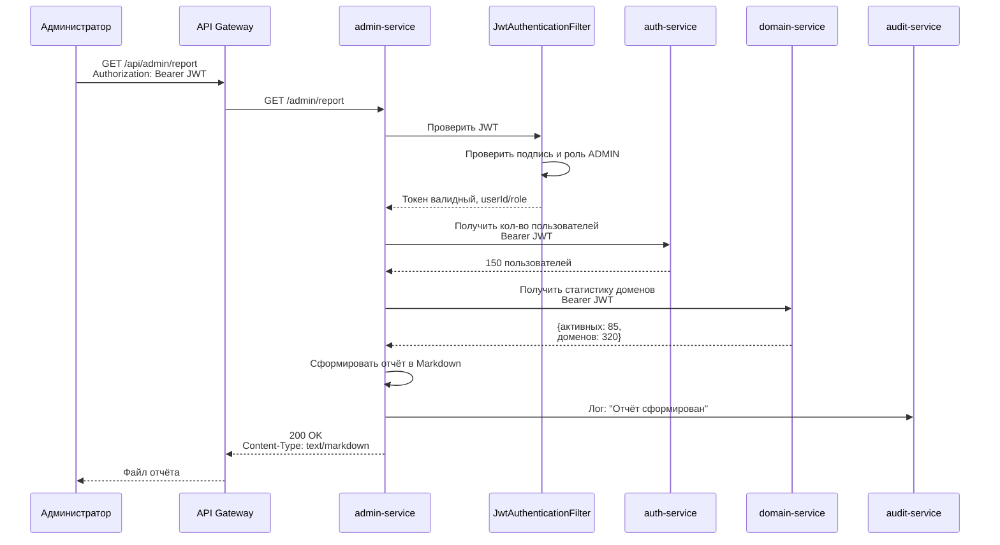
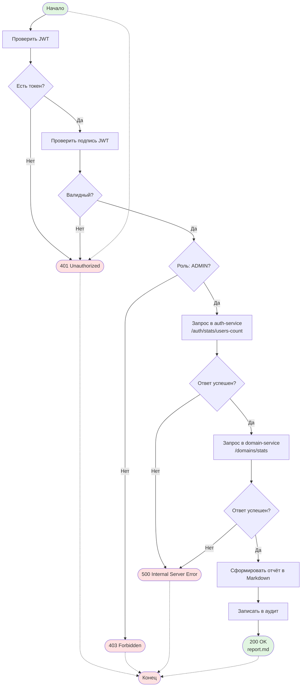
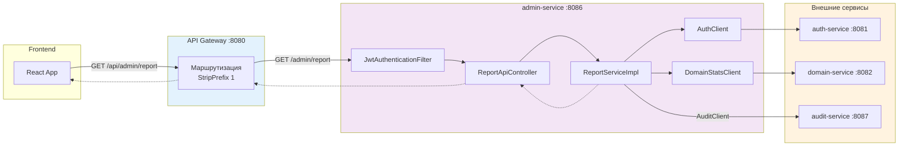
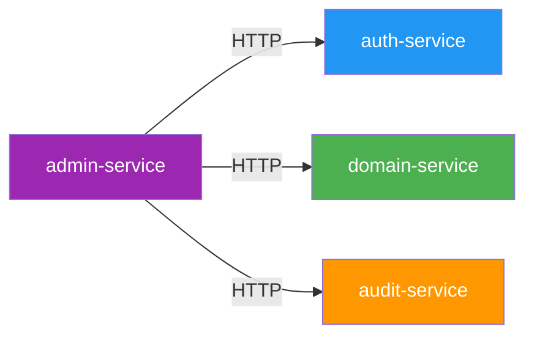

# admin-service

Сервис для формирования административных отчётов в микросервисной системе регистрации доменов.

## Описание

admin-service — это Spring Boot микроервис, который агрегирует данные из других сервисов (auth-service, domain-service) для генерации административных отчётов в формате Markdown. Сервис не имеет собственной базы данных и работает как агрегатор статистики.

## Основные функции

- Генерация отчётов с общей статистикой системы
- Получение количества зарегистрированных пользователей из auth-service
- Получение статистики доменов из domain-service
- Логирование действий в audit-service
- Доступ только для пользователей с ролью ADMIN

## Технологический стек

- **Java 17**
- **Spring Boot 3.2.0**
- **OpenAPI Generator** — генерация API интерфейсов из YAML спецификации
- **Spring Security** — защита JWT-аутентификацией
- **Lombok** — сокращение бойлерплейта

## Структура проекта

```
admin-service/
├── config/                    # Конфигурация бинов Spring
│   ├── AuditConfig.java       # Конфигурация AuditClient
│   ├── JwtConfig.java         # Конфигурация JWT
│   ├── OpenApiConfig.java     # Настройка Swagger/OpenAPI
│   ├── RestTemplateConfig.java # Настройка HTTP клиента
│   └── SecurityConfig.java    # Spring Security + JWT фильтр
├── controller/                # REST контроллеры
│   ├── HealthApiController.java    # Проверка здоровья
│   └── ReportApiController.java    # Скачивание отчёта
├── security/                  # Слой безопасности
│   └── JwtAuthenticationFilter.java
├── service/                   # Бизнес-логика
│   ├── ReportService.java
│   └── impl/ReportServiceImpl.java
├── client/                    # Клиенты для других сервисов
│   ├── AuthClient.java           # Клиент auth-service
│   └── DomainStatsClient.java    # Клиент domain-service
└── exception/                 # Обработка ошибок
    └── GlobalExceptionHandler.java
```

## Конфигурация

| Параметр | Описание | По умолчанию |
|----------|----------|--------------|
| `server.port` | Порт сервиса | 8086 |
| `JWT_SECRET` | Ключ для подписи JWT токенов | - |
| `AUTH_SERVICE_URL` | Базовый URL auth-service | http://localhost:8081 |
| `DOMAIN_SERVICE_URL` | Базовый URL domain-service | http://localhost:8082 |
| `AUDIT_SERVICE_URL` | Базовый URL audit-service | http://localhost:8087 |

## API Endpoints

| Метод | Эндпоинт | Описание                     | Требуется роль |
|-------|----------|------------------------------|----------------|
| GET | `/admin/health` | Проверка здоровья сервиса    | Нет |
| GET | `/admin/report` | Скачивание отчёта (Markdown) | ADMIN |

### Получение отчёта

**Запрос:**
```http
GET /admin/report
Authorization: Bearer <jwt-token>
```

**Ответ:**
```http
Content-Type: text/markdown
Content-Disposition: attachment; filename${DB_USER:***REMOVED***}"report.md"

# Отчёт администратора

**Дата формирования:** 15.02.2026 12:30:45

---

## Статистика

| Показатель | Значение |
|---|---|
| Количество зарегистрированных пользователей | 150 |
| Количество активных пользователей | 85 |
| Количество зарегистрированных доменов | 320 |

---

*Отчёт сформирован автоматически сервисом admin-service.*
```

## Диаграммы

### Sequence Diagram — Формирование отчёта



### BPMN Diagram — Процесс генерации отчёта



### BPMN Diagram — Поток запроса через API Gateway



## Зависимости между сервисами



## Логирование

При формировании отчёта сервис отправляет событие аудита в audit-service:
```
"Admin report generated"
```

## Security

- JWT токены проверяются через `JwtUtil` из модуля `common`
- Эндпоинт `/admin/report` доступен только пользователям с ролью `ADMIN`
- Эндпоинт `/admin/health` публичный токен аутентификации

## Мониторинг

Актuator эндпоинты:
- `/actuator/health` — состояние сервиса
- `/actuator/info` — информация о сервисе
- `/actuator/metrics` — метрики приложения

## Swagger UI

Документация API доступна по адресу: `http://localhost:8086/swagger-ui.html`
