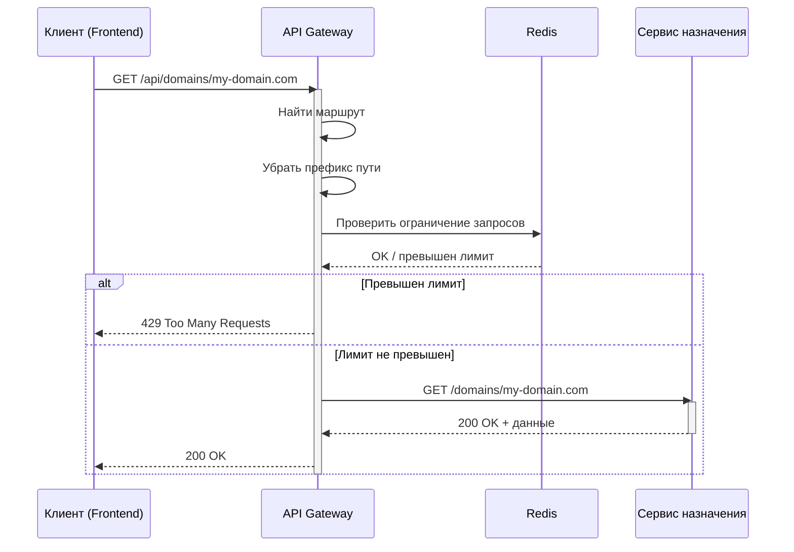
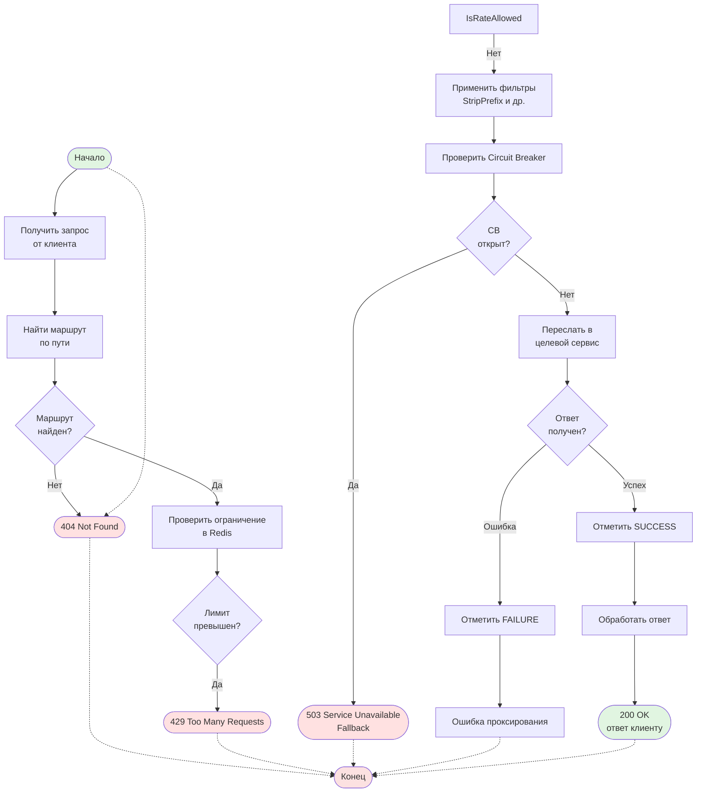
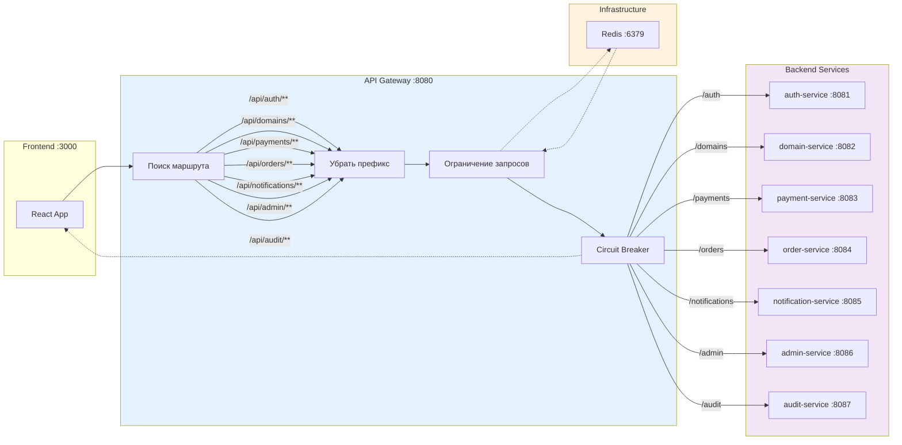

# api-gateway

API Gateway для микросервисной системы регистрации доменов.

## Описание

api-gateway — это Spring Cloud Gateway, который служит единой точкой входа для всех клиентских запросов. Он выполняет маршрутизацию запросов к соответствующим микросервисам, обрабатывает CORS, обеспечивает rate limiting через Redis и реализует circuit breaker для отказоустойчивости.

## Основные функции

- Маршрутизация запросов по путям к соответствующим микросервисам
- Обработка CORS запросов (только в Docker профиле)
- Rate limiting с помощью Redis
- Circuit breaker (Resilience4j) для защиты от каскадных отказов
- Удаление префикса пути (`StripPrefix${DB_USER:***REMOVED***}1`) при проксировании

## Технологический стек

- **Java 17**
- **Spring Boot 3.2.0**
- **Spring Cloud Gateway** (на базе WebFlux, неблокирующий)
- **Spring Cloud 2023.0.0**
- **Spring Data Redis Reactive**
- **Resilience4j** — circuit breaker
- **Lombok**

## Структура проекта

```
api-gateway/
├── src/
│   ├── main/
│   │   ├── java/ru/itmo/gateway/
│   │   │   └── GatewayApplication.java    # Точка входа приложения
│   │   └── resources/
│   │       ├── application.yml            # Конфигурация по умолчанию (localhost)
│   │       └── application-docker.yml     # Конфигурация для Docker
├── build.gradle.kts                       # Gradle конфигурация
└── Dockerfile                             # Мульти-стейдж Docker сборка
```

## Конфигурация

| Параметр | Описание | По умолчанию |
|----------|----------|--------------|
| `server.port` | Порт сервиса | 8080 |
| `API_GATEWAY_STRIP_PREFIX` | Количество удаляемых сегментов пути | 1 |
| `CORS_ALLOWED_ORIGINS` | Разрешённые origins для CORS | * |
| `spring.data.redis.host` | Хост Redis | localhost / redis |
| `spring.data.redis.port` | Порт Redis | 6379 |

## Маршрутизация

| Path Pattern       | Target Service   | Target Port | Description |
|--------------------|------------------|-------------|-------------|
| `/api/auth/**`     | auth-service     | 8081        | Аутентификация, пользователи, 2FA |
| `/api/users/**`    | auth-service     | 8081        | Управление пользователями |
| `/api/domains/**`  | domain-service   | 8082        | Регистрация доменов, DNS записи |
| `/api/payments/**` | payment-service  | 8083        | Обработка платежей |
| `/api/orders/**`   | order-service    | 8084        | Корзина, заказы, продление |
| `/api/notifications/**` | notification-service | 8085 | Email уведомления |
| `/api/admin/**`    | admin-service    | 8086        | Административные отчёты |
| `/api/audit/**`    | audit-service    | 8087        | Логирование аудита |

## Пример запроса

**Запрос через Gateway:**
```http
GET /api/domains/my-domain.com
Host: api-gateway:8080
Authorization: Bearer jwt-token
```

**Проксируется в domain-service как:**
```http
GET /domains/my-domain.com
Host: domain-service:8082
```

## Actuator Endpoints

- `/actuator/health` — состояние сервиса
- `/actuator/info` — информация о сервисе
- `/actuator/metrics` — метрики приложения

## Диаграммы

### Sequence Diagram — Поток запроса через Gateway



### BPMN Diagram — Процесс обработки запроса



### BPMN Diagram — Архитектура маршрутизации


