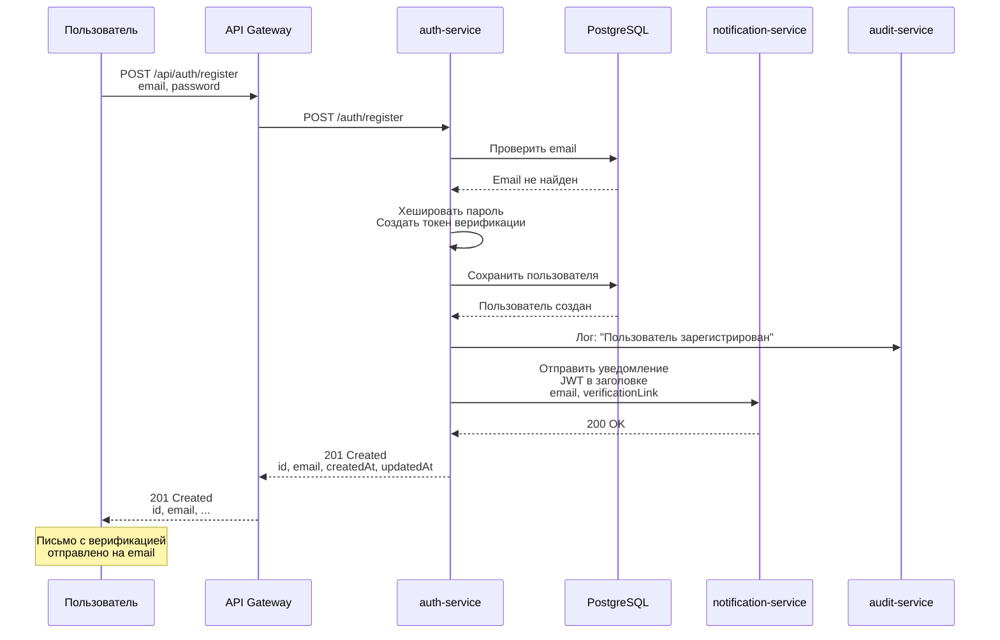
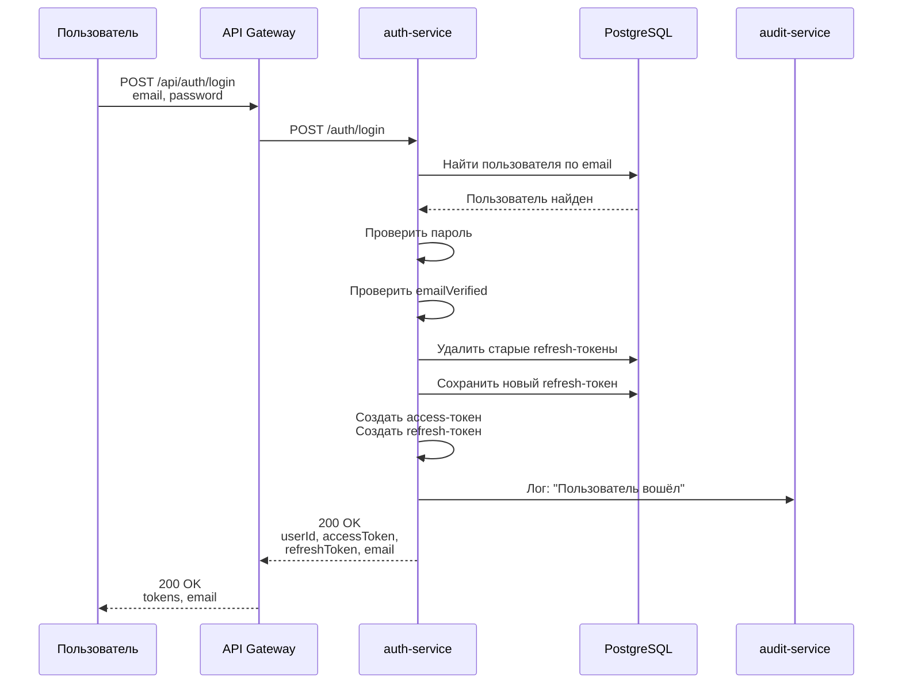
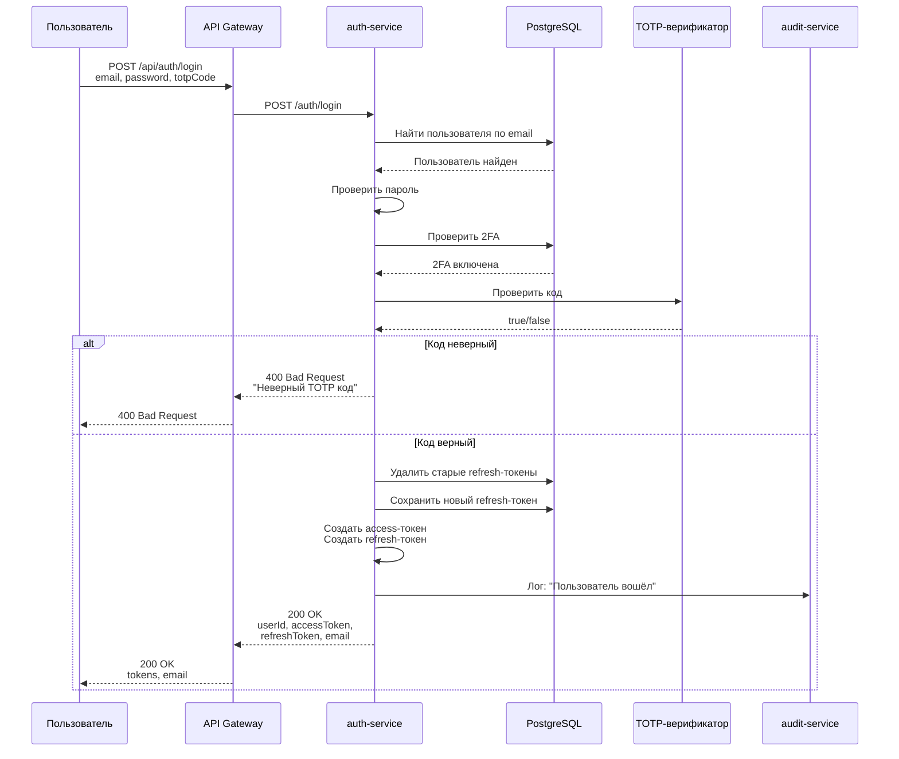
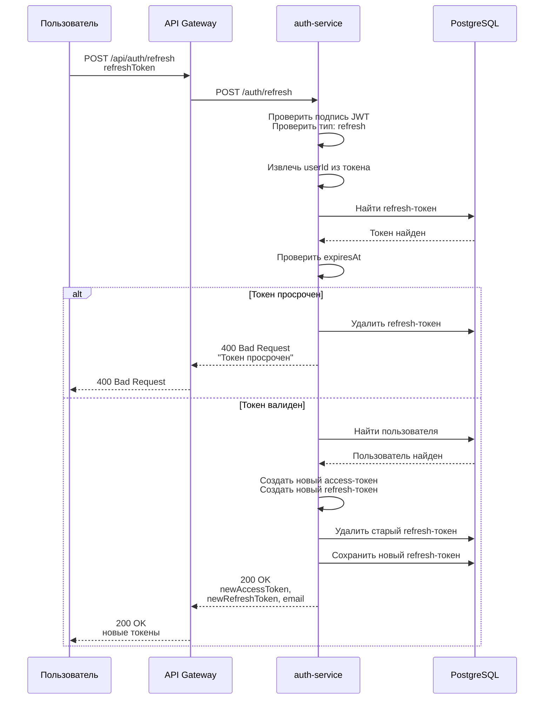
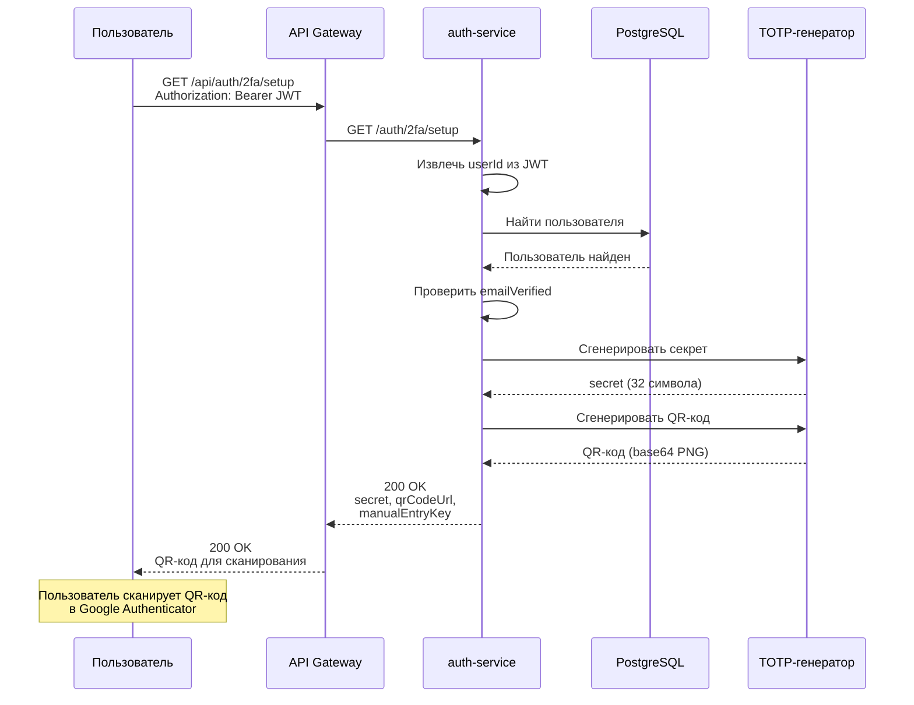
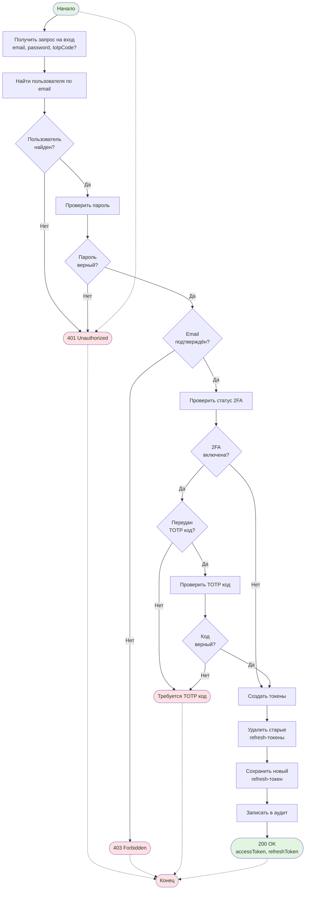
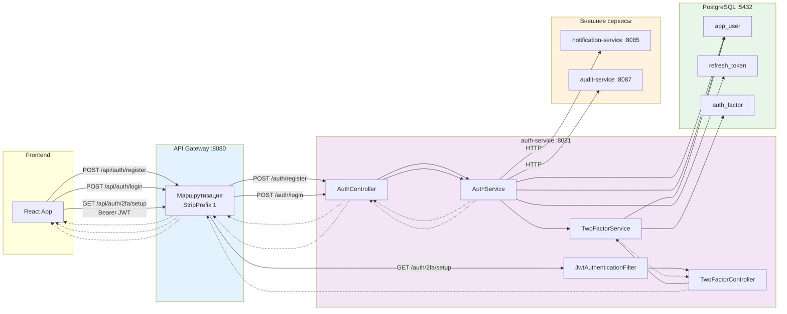
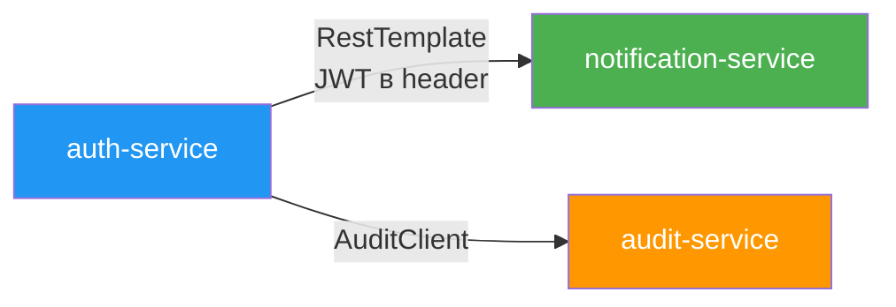

# auth-service

Сервис аутентификации и управления пользователями в микросервисной системе регистрации доменов.

## Описание

auth-service — это Spring Boot микросервис, который предоставляет функциональность аутентификации, регистрации пользователей, управления JWT токенами и двухфакторной аутентификации (2FA) на базе TOTP (совместимый с Google Authenticator).

## Основные функции

- Регистрация пользователей с email верификацией
- Аутентификация с JWT токенами (access token + refresh token)
- Отправка писем верификации через notification-service
- Двухфакторная аутентификация (TOTP, Google Authenticator)
- Обновление токенов с ротацией refresh token
- Логирование событий в audit-service
- Административные эндпоинты для получения статистики
- Внутренние эндпоинты для межсервисного взаимодействия

## Технологический стек

- **Java 17**
- **Spring Boot 3.2.0**
- **Spring Security** — JWT аутентификация
- **Spring Data JPA** — работа с данными
- **PostgreSQL** — база данных
- **Liquibase** — миграции базы данных
- **HikariCP** — пул соединений
- **JJWT 0.12.3** — создание и валидация JWT токенов
- **TOTP 1.7.1** — двухфакторная аутентификация
- **SpringDoc OpenAPI** — Swagger UI
- **Lombok** — сокращение бойлерплейта

## Структура проекта

```
auth-service/
├── config/                        # Конфигурация бинов Spring
│   ├── AuditConfig.java           # Конфигурация AuditClient
│   ├── PasswordEncoderConfig.java # BCrypt кодировщик паролей
│   ├── RestTemplateConfig.java    # Настройка HTTP клиента
│   └── SecurityConfig.java        # Spring Security + JWT фильтр
├── controller/                    # REST контроллеры
│   ├── AuthController.java        # /auth/* эндпоинты
│   ├── TwoFactorController.java   # /auth/2fa/* эндпоинты
│   ├── UserController.java        # /users/* эндпоинты
│   ├── InternalController.java    # /auth/internal/* межсервисные
│   └── StatsController.java       # /auth/stats/* админские
├── service/                       # Бизнес-логика
│   ├── AuthService.java           # Основная логика аутентификации
│   ├── TwoFactorService.java      # Логика 2FA (TOTP)
│   └── UserService.java           # Поиск пользователей
├── entity/                        # JPA сущности
│   ├── User.java                  # Пользователь
│   ├── RefreshToken.java          # Refresh токен
│   └── AuthFactor.java            # Фактор аутентификации
├── repository/                    # Spring Data JPA репозитории
│   ├── UserRepository.java        # CRUD пользователей
│   ├── RefreshTokenRepository.java # CRUD refresh токенов
│   └── AuthFactorRepository.java  # CRUD факторов аутентификации
├── security/                      # Слой безопасности
│   └── JwtAuthenticationFilter.java # JWT фильтр
├── dto/                           # DTO для запросов/ответов
├── util/                          # Утилиты
│   ├── JwtUtil.java               # Генерация/валидация JWT
│   └── SecurityUtil.java          # Получение текущего пользователя
└── exception/                     # Обработка ошибок
    ├── GlobalExceptionHandler.java # Глобальный обработчик
    └── *Exception.java            # Исключения
```

## База данных

**Таблицы:**

| Таблица | Описание |
|---------|----------|
| `app_user` | Пользователи системы |
| `refresh_token` | JWT refresh токены |
| `auth_factor` | Факторы двухфакторной аутентификации |

**База данных:** `auth_db` (PostgreSQL)

## Конфигурация

| Параметр | Описание | По умолчанию |
|----------|----------|--------------|
| `server.port` | Порт сервиса | 8081 |
| `JWT_SECRET` | Ключ для подписи JWT токенов | your-256-bit-secret-key... |
| `jwt.access-token-expiration-minutes` | Время жизни access токена (мин) | 15 |
| `jwt.refresh-token-expiration-days` | Время жизни refresh токена (дни) | 30 |
| `AUDIT_SERVICE_URL` | Базовый URL audit-service | http://localhost:8087 |
| `NOTIFICATION_SERVICE_URL` | Базовый URL notification-service | http://localhost:8085 |
| `API_GATEWAY_URL` | Базовый URL api-gateway | http://localhost:8080 |
| `verification.base-url` | Базовый URL для верификации | http://localhost:8080 |

## API Endpoints

### Аутентификация

| Метод | Эндпоинт | Описание | Требуется аутентификация |
|-------|----------|----------|--------------------------|
| POST | `/auth/register` | Регистрация пользователя | Нет |
| POST | `/auth/login` | Вход в систему | Нет |
| GET | `/auth/verify-email` | Верификация email | Нет |
| POST | `/auth/resend-verification` | Повторная отправка верификации | Нет |
| POST | `/auth/refresh` | Обновление токенов | Нет |
| GET | `/auth/health` | Проверка здоровья сервиса | Нет |

### Двухфакторная аутентификация

| Метод | Эндпоинт | Описание | Требуется аутентификация |
|-------|----------|----------|--------------------------|
| GET | `/auth/2fa/setup` | Генерация QR-кода для 2FA | Да |
| POST | `/auth/2fa/enable` | Включение 2FA | Да |
| POST | `/auth/2fa/disable` | Отключение 2FA | Да |
| GET | `/auth/2fa/status` | Статус 2FA | Да |

### Пользователи

| Метод | Эндпоинт | Описание | Требуется аутентификация |
|-------|----------|----------|--------------------------|
| GET | `/users/{id}` | Получить пользователя по ID | Да |
| GET | `/users/{id}/email` | Получить email пользователя | Да |

### Статистика (ADMIN)

| Метод | Эндпоинт | Описание | Требуется роль |
|-------|----------|----------|----------------|
| GET | `/auth/stats/users-count` | Количество пользователей | ADMIN |

### Внутренние (ADMIN)

| Метод | Эндпоинт | Описание | Требуется роль |
|-------|----------|----------|----------------|
| POST | `/auth/internal/emails` | Получить email по ID пользователей | ADMIN |

## Диаграммы

### Sequence Diagram — Регистрация



### Sequence Diagram — Вход без 2FA



### Sequence Diagram — Вход с 2FA



### Sequence Diagram — Обновление токенов



### Sequence Diagram — Настройка 2FA



### BPMN Diagram — Процесс входа в систему



### BPMN Diagram — Процесс регистрации

```mermaid
flowchart TD
    Start([Начало]) --> Receive[Получить запрос на регистрацию<br/>email, password]

    Receive --> Validate[Валидировать данные<br/>password >${DB_USER:***REMOVED***} 8 символов]
    Validate --> ValidData{Данные<br/>валидны?}

    ValidData -- Нет --> ValidationFail([400 Bad Request<br/>Ошибка валидации])
    ValidData -- Да --> CheckEmail[Проверить email<br/>на занятость]

    CheckEmail --> EmailExists{Email уже<br/>существует?}

    EmailExists -- Да --> EmailFail([409 Conflict])
    EmailExists -- Нет --> HashPass[Хешировать пароль]

    HashPass --> GenerateToken[Создать<br/>verificationToken UUID]

    GenerateToken --> SaveUser[Сохранить пользователя в БД]

    SaveUser --> LogAudit["User registered"]

    LogAudit --> BuildLink[Сформировать<br/>verificationLink]
    BuildLink --> SendEmail[Отправить email через<br/>notification-service]

    SendEmail --> EmailSent{Email отправлен<br/>успешно?}

    EmailSent -- Нет --> LogWarning[Лог warning<br/>продолжаем]
    EmailSent -- Да --> CreateResponse
    LogWarning --> CreateResponse[Сформировать ответ]

    CreateResponse --> Return201([201 Created<br/>id, email, ...])

    Start -.-> ValidationFail
    ValidationFail -.-> End([Конец])
    EmailFail -.-> End
    Return201 -.-> End

    style Start fill:#e1f5e1
    style End fill:#fce1e1
    style Return201 fill:#e1f5e1
    style ValidationFail fill:#ffe1e1
    style EmailFail fill:#ffe1e1
```

### BPMN Diagram — Поток запроса через API Gateway



## Зависимости между сервисами



## JWT Токены

Типы токенов:

| Тип | Срок действия | Хранение | Назначение |
|-----|---------------|----------|------------|
| Access Token | 15 минут | Клиент (localStorage/cookie) | Доступ к защищённым эндпоинтам |
| Refresh Token | 30 дней | База данных (refresh_token) | Получение нового access token |

**Payload Access Token:**
```json
{
  "sub": "user-uuid",
  "email": "user@example.com",
  "role": "USER",
  "type": "access",
  "iat": 1234567890,
  "exp": 1234568790
}
```

## Двухфакторная аутентификация

**TOTP параметры:**
- Алгоритм: SHA1
- Длина кода: 6 цифр
- Период: 30 секунд
- Совместимость: Google Authenticator, Authy, etc.

**Процесс настройки:**
1. Пользователь запрашивает setup: `GET /auth/2fa/setup`
2. Сервис генерирует секрет и QR-код
3. Пользователь сканирует QR-код в Google Authenticator
4. Пользователь подтверждает код: `POST /auth/2fa/enable`
5. После включения login требует TOTP код

## Security

- Пароли хешируются алгоритмом BCrypt
- JWT токены подписываются секретным ключом (`JWT_SECRET`)
- Refresh токены хранятся в базе данных для возможности отзыва
- Защищённые эндпоинты требуют Bearer токен в заголовке `Authorization`
- Проверка роли ADMIN для административных эндпоинтов
- email должен быть верифицирован для входа

## Логирование

Сервис отправляет события аудита в audit-service:
- `"User registered: {email}"` — при регистрации
- `"Email verified"` — при верификации email
- `"User logged in"` — при входе
- `"Tokens refreshed"` — при обновлении токенов

## Мониторинг

Actuator эндпоинты:
- `/actuator/health` — состояние сервиса
- `/actuator/info` — информация о сервисе
- `/actuator/metrics` — метрики приложения

## Swagger UI

Документация API доступна по адресу: `http://localhost:8081/swagger-ui.html`

## Примеры запросов

### Регистрация

```http
POST /api/auth/register
Content-Type: application/json

{
  "email": "user@example.com",
  "password": "SecurePass123"
}
```

**Ответ:**
```http
HTTP/1.1 201 Created
Content-Type: application/json

{
  "success": true,
  "data": {
    "id": "550e8400-e29b-41d4-a716-446655440000",
    "email": "user@example.com",
    "createdAt": "2026-02-18T10:00:00",
    "updatedAt": "2026-02-18T10:00:00"
  }
}
```

### Вход

```http
POST /api/auth/login
Content-Type: application/json

{
  "email": "user@example.com",
  "password": "SecurePass123"
}
```

**Ответ:**
```http
HTTP/1.1 200 OK
Content-Type: application/json

{
  "success": true,
  "data": {
    "userId": "550e8400-e29b-41d4-a716-446655440000",
    "accessToken": "eyJhbGciOiJIUzI1NiIsInR5cCI6IkpXVCJ9...",
    "refreshToken": "eyJhbGciOiJIUzI1NiIsInR5cCI6IkpXVCJ9...",
    "email": "user@example.com"
  }
}
```

### Обновление токенов

```http
POST /api/auth/refresh
Content-Type: application/json

{
  "refreshToken": "eyJhbGciOiJIUzI1NiIsInR5cCI6IkpXVCJ9..."
}
```

**Ответ:**
```http
HTTP/1.1 200 OK
Content-Type: application/json

{
  "success": true,
  "data": {
    "userId": "550e8400-e29b-41d4-a716-446655440000",
    "accessToken": "eyJhbGciOiJIUzI1NiIsInR5cCI6IkpXVCJ9...",
    "refreshToken": "eyJhbGciOiJIUzI1NiIsInR5cCI6IkpXVCJ9...",
    "email": "user@example.com"
  }
}
```
