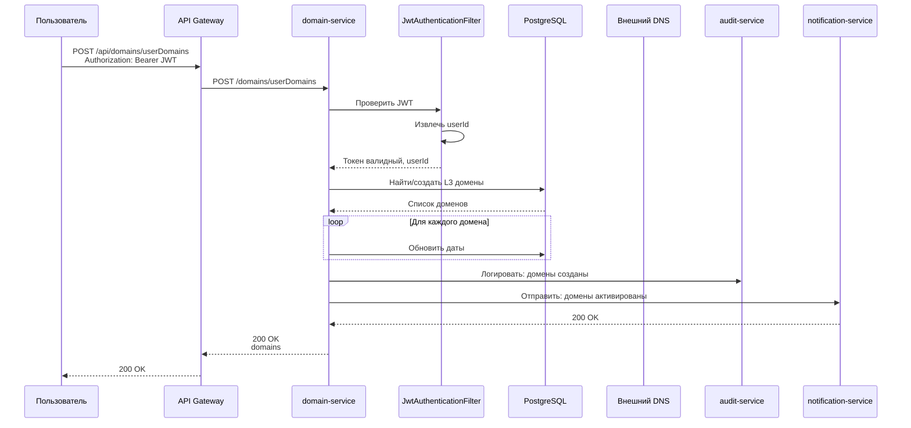
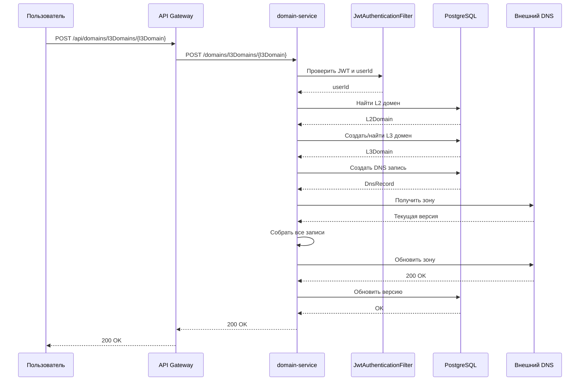
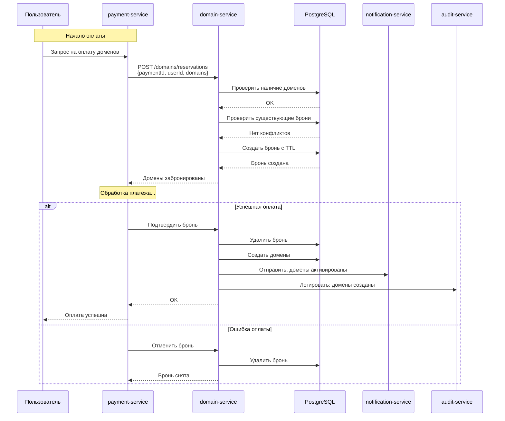
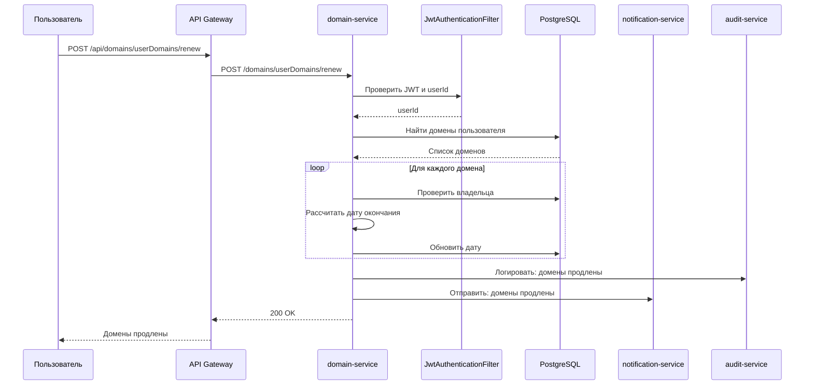
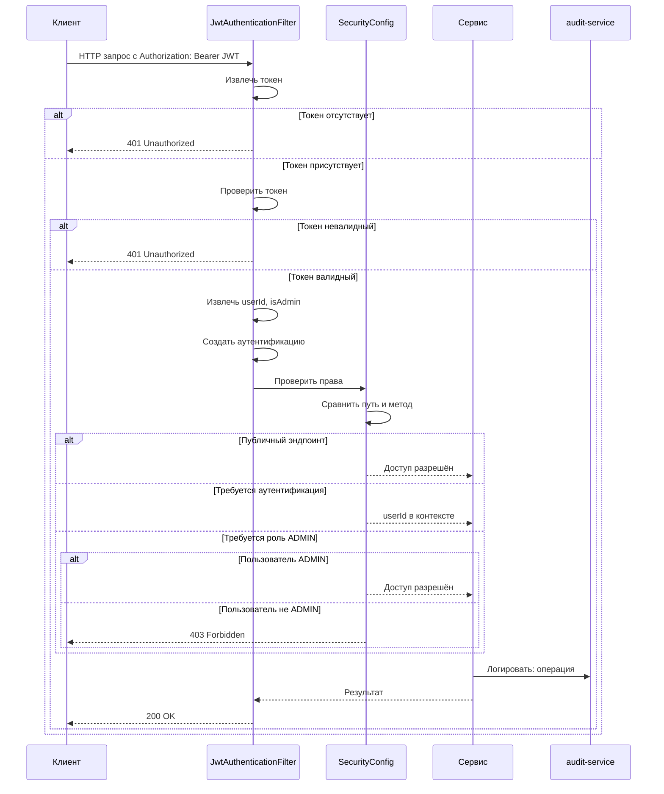
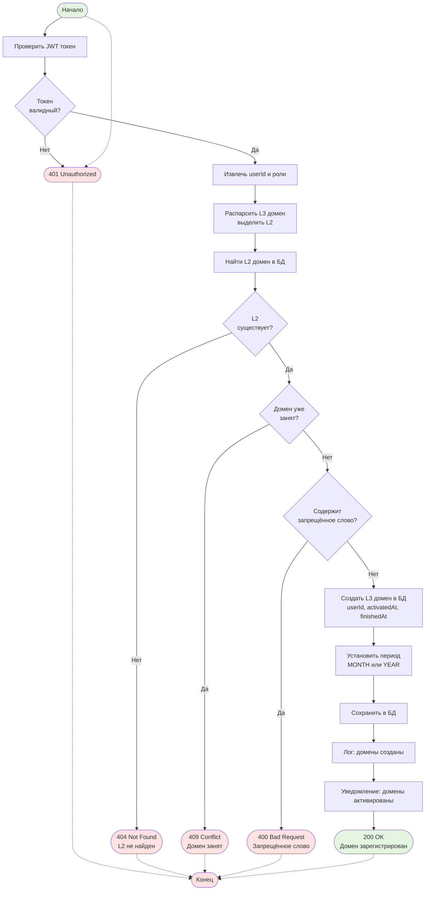
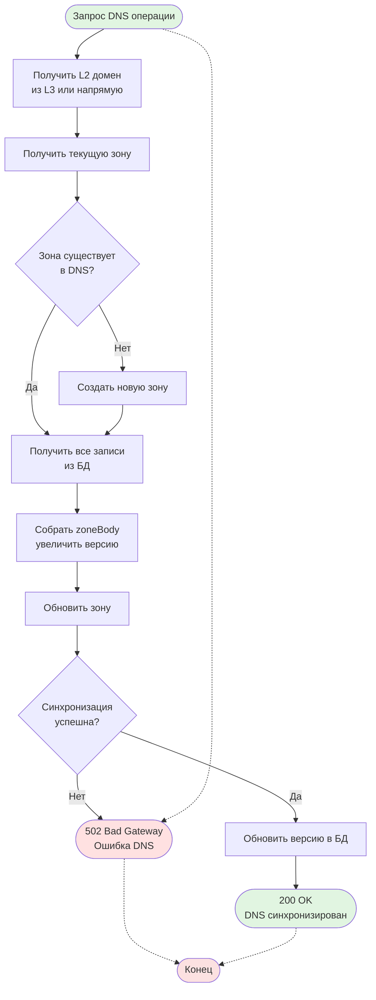
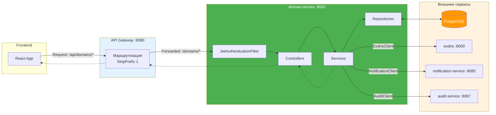
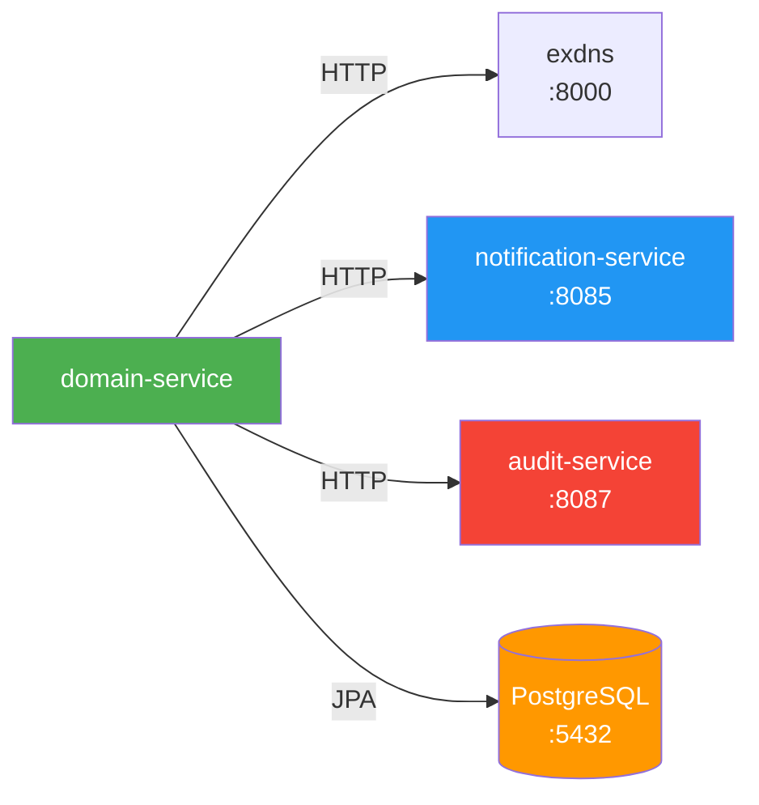
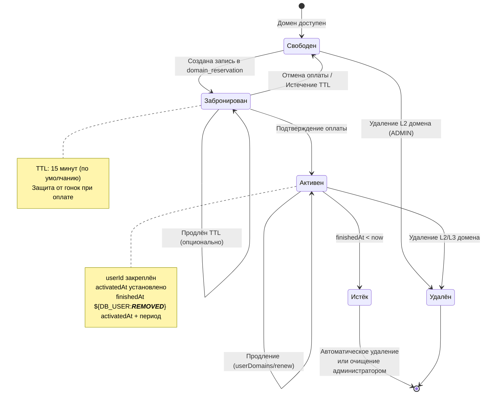

# domain-service

Сервис для управления доменами и DNS записями в микросервисной системе регистрации доменов.

## Описание

domain-service — это Spring Boot микросервис, который управляет регистрацией доменов (L2 и L3 уровня), DNS записями, синхронизацией с внешним DNS сервером и системой бронирования доменов при оплате.

## Основные функции

- Управление L2 доменами (зонами) и их DNS записями
- Управление L3 доменами пользователей
- Синхронизация DNS записей с внешним DNS сервером (exdns)
- Бронирование доменов на время оплаты
- Продление доменов
- Отправка уведомлений о регистрации и продлении доменов
- Логирование действий в audit-service
- RBAC авторизация (ADMIN/USER роли)

## Технологический стек

- **Java 17**
- **Spring Boot 3.2.0**
- **Spring Data JPA** — работа с базой данных PostgreSQL
- **Liquibase** — управление миграциями БД
- **Spring Security** — защита JWT-аутентификацией
- **OpenAPI Generator** — генерация API интерфейсов из YAML спецификации
- **Lombok** — сокращение бойлерплейта
- **HikariCP** — пул соединений с БД

## Структура проекта

```
domain-service/
├── config/                    # Конфигурация бинов Spring
│   ├── AuditConfig.java       # Конфигурация AuditClient
│   ├── ExdnsClientConfig.java # Конфигурация ExdnsClient
│   ├── JwtConfig.java         # Конфигурация JWT
│   ├── OpenApiConfig.java     # Настройка Swagger/OpenAPI
│   └── SecurityConfig.java    # Spring Security + JWT фильтр
├── controller/                # REST контроллеры
│   ├── L2DomainApiController.java    # Управление L2 доменами
│   ├── L3DomainApiController.java    # Управление L3 доменами
│   ├── DnsRecordApiController.java   # Управление DNS записями
│   ├── UserDomainApiController.java  # Управление доменами пользователей
│   ├── DomainReservationController.java # Бронирование доменов
│   ├── StatsApiController.java       # Статистика
│   └── ExpiringDomainsController.java # Домены, истекающие скоро
├── service/                   # Бизнес-логика
│   ├── L2DomainService.java   # Интерфейс сервиса L2 доменов
│   ├── L2DomainServiceImpl.java
│   ├── L3DomainService.java   # Интерфейс сервиса L3 доменов
│   ├── DnsRecordService.java  # Интерфейс сервиса DNS записей
│   ├── DnsRecordServiceImpl.java
│   ├── UserDomainService.java # Интерфейс сервиса доменов пользователей
│   ├── UserDomainServiceImpl.java
│   ├── DomainStatsService.java
│   ├── DomainReservationService.java # Бронирование доменов
│   └── DomainReservationServiceImpl.java
├── repository/                # Spring Data JPA репозитории
│   ├── DomainRepository.java
│   ├── DnsRecordRepository.java
│   ├── BadWordRepository.java
│   └── DomainReservationRepository.java
├── entity/                    # JPA сущности
│   ├── Domain.java            # Домен (L2/L3)
│   ├── DnsRecord.java         # DNS запись
│   ├── BadWord.java           # Запрещённые слова
│   └── DomainReservation.java # Бронирование
├── client/                    # Клиенты для внешних сервисов
│   ├── ExdnsClient.java       # Внешний DNS сервер
│   └── NotificationClient.java # Сервис уведомлений
├── security/                  # Слой безопасности
│   └── JwtAuthenticationFilter.java
└── util/
    └── SecurityUtil.java      # Утилиты для работы с SecurityContext
```

## Конфигурация

| Параметр | Описание | По умолчанию |
|----------|----------|--------------|
| `server.port` | Порт сервиса | 8082 |
| `JWT_SECRET` | Ключ для подписи JWT токенов | - |
| `EXDNS_API_TOKEN` | Токен для внешнего DNS API | changeme |
| `EXDNS_BASE_URL` | Базовый URL внешнего DNS | http://localhost:8000 |
| `NOTIFICATION_SERVICE_URL` | Базовый URL notification-service | http://localhost:8085 |
| `AUDIT_SERVICE_URL` | Базовый URL audit-service | http://localhost:8087 |
| `DOMAIN_RESERVATION_TTL_MINUTES` | Время жизни бронирования | 15 |

## API Endpoints

### L2 Домены

| Метод | Эндпоинт | Описание | Требуется роль |
|-------|----------|----------|----------------|
| GET | `/domains/l2Domains` | Получить все L2 домены | Нет |
| POST | `/domains/l2Domains` | Создать L2 домен (зону) | ADMIN |
| DELETE | `/domains/l2Domains/{l2Domain}` | Удалить L2 домен | ADMIN |
| POST | `/domains/l2Domains/{l2Domain}` | Создать DNS запись для L2 | ADMIN |
| GET | `/domains/l2Domains/{l2Domain}` | Получить DNS записи L2 домена | ADMIN |

### L3 Домены

| Метод | Эндпоинт | Описание | Требуется роль |
|-------|----------|----------|----------------|
| POST | `/domains/l3Domains/{l3Domain}` | Создать L3 домен с DNS записью | Authenticated |
| GET | `/domains/l3Domains/{l3Domain}/dnsRecords` | Получить DNS записи L3 домена | Authenticated (только свои) |
| POST | `/domains/l3Domains/{l3Domain}/ns` | Создать NS запись для L3 | Authenticated |
| GET | `/domains/l3Domains/{name}/free` | Получить свободные L3 домены | Нет |

### Домены пользователя

| Метод | Эндпоинт | Описание | Требуется роль |
|-------|----------|----------|----------------|
| GET | `/domains/userDomains` | Получить L3 домены пользователя | Authenticated |
| POST | `/domains/userDomains` | Создать L3 домены для пользователя | Authenticated |
| POST | `/domains/userDomains/renew` | Продлить L3 домены | Authenticated |
| GET | `/domains/userDomains/detailed` | Детальная информация о доменах | Authenticated |
| DELETE | `/domains/userDomains/expired` | Удалить истёкшие домены | ADMIN |
| GET | `/domains/userDomains/expiring?days${DB_USER:***REMOVED***}N` | Домены, истекающие через N дней | ADMIN |

### DNS Записи

| Метод | Эндпоинт | Описание | Требуется роль |
|-------|----------|----------|----------------|
| GET | `/domains/dnsRecords/{id}` | Получить DNS запись по ID | ADMIN |
| PUT | `/domains/dnsRecords/{id}` | Обновить DNS запись | Authenticated (только свои) |
| DELETE | `/domains/dnsRecords/{id}` | Удалить DNS запись | Authenticated (только свои) |

### Бронирование доменов

| Метод | Эндпоинт | Описание | Требуется роль |
|-------|----------|----------|----------------|
| POST | `/domains/reservations` | Забронировать домены на время оплаты | Authenticated |
| POST | `/domains/reservations/{paymentId}/confirm` | Подтвердить бронь (после оплаты) | Authenticated |
| DELETE | `/domains/reservations/{paymentId}` | Отменить бронь | Authenticated |
| POST | `/domains/reservations/cleanup` | Очистить истёкшие брони | Authenticated |

### Статистика

| Метод | Эндпоинт | Описание | Требуется роль |
|-------|----------|----------|----------------|
| GET | `/domains/stats` | Получить статистику доменов | ADMIN |

## Диаграммы

### Sequence Diagram — Регистрация L3 домена пользователем



### Sequence Diagram — Управление DNS записями



### Sequence Diagram — Бронирование и оплата домена



### Sequence Diagram — Продление домена



### Sequence Diagram — Безопасность и авторизация



### BPMN Diagram — Общий поток регистрации домена



### BPMN Diagram — Процесс синхронизации DNS с внешним сервером



### BPMN Diagram — Поток запроса через API Gateway



### BPMN Diagram — Бронирование и оплата домена

```mermaid
flowchart TD
    Start([Начало оплаты]) --> ReserveRequest[POST /domains/reservations<br/>paymentId, userId, domains]

    ReserveRequest --> CheckL2[Проверить существование L2]
    CheckL2 --> L2Valid{Все L2<br/>существуют?}
    L2Valid -- Нет --> Return404([404 Not Found<br/>L2 не найден])

    L2Valid -- Да --> CheckOwned{Домены уже<br/>заняты?}
    CheckOwned -- Да --> Return409([409 Conflict<br/>Домен занят])

    CheckOwned -- Нет --> CheckReservation{Есть активные<br/>брони?}
    CheckReservation -- Да --> Return409([409 Conflict<br/>Домен забронирован])

    CheckReservation -- Нет --> CreateReservation[Создать бронь<br/>expiresAt ${DB_USER:***REMOVED***} now + TTL]

    CreateReservation --> Return202([202 Accepted<br/>Домены забронированы])

    Return202 --> Payment[Обработка платежа]

    Payment --> PaymentResult{Результат<br/>оплаты}

    PaymentResult -- Успех --> Confirm[Подтвердить бронь]
    Confirm --> DeleteReservation[Удалить бронь]
    DeleteReservation --> CreateDomains[Создать домены в БД]
    CreateDomains --> AuditCreate[Лог: домены созданы]
    AuditCreate --> NotifCreate[Уведомление отправлено]
    NotifCreate --> PaymentSuccess([Успех<br/>домены созданы])

    PaymentResult -- Отмена --> Cancel[Отменить бронь]
    Cancel --> DeleteReservation2[Удалить бронь]
    DeleteReservation2 --> PaymentFailed([Отмена<br/>бронь снята])

    Start -.-> Return404
    Return404 -.-> End([Конец])
    Return409 -.-> End
    PaymentSuccess -.-> End
    PaymentFailed -.-> End

    style Start fill:#e1f5e1
    style End fill:#fce1e1
    style PaymentSuccess fill:#e1f5e1
    style PaymentFailed fill:#ffe1e1
    style Return404 fill:#ffe1e1
    style Return409 fill:#ffe1e1
    style Return202 fill:#fff9e6
```

## Зависимости между сервисами



## Жизненный цикл домена



## Логирование

### Аудит события
Сервис отправляет события аудита в audit-service:
- `"Domains created"` — при создании доменов пользователем
- `"Domains renewed"` — при продлении доменов
- `"Expired domains deleted: N"` — при удалении истёкших доменов

### Уведомления
Сервис отправляет уведомления в notification-service:
- `DOMAIN_ACTIVATED` — при регистрации домена
- `DOMAIN_RENEWED` — при продлении домена

## Security

- JWT токены проверяются через `JwtUtil` из модуля `common`
- Тип токена: `access`
- userId извлекается из токена и сохраняется как principal в Spring Security Context
- Роли:
  - `ROLE_USER` — все аутентифицированные пользователи
  - `ROLE_ADMIN` — администраторы
- Проверка владельца домена на уровне сервисов:
  - Пользователи могут менять только свои домены и DNS записи
  - Администраторы могут менять любые домены

## Мониторинг

Actuator эндпоинты:
- `/actuator/health` — состояние сервиса
- `/actuator/info` — информация о сервисе
- `/actuator/metrics` — метрики приложения

## Swagger UI

Документация API доступна по адресу: `http://localhost:8082/swagger-ui.html`

## Типы DNS записей

Поддерживаемые типы DNS записей:
- `A` — IPv4 адрес
- `AAAA` — IPv6 адрес
- `NS` — Name Server
- `MX` — Mail Exchange
- `TXT` — Текстовая запись
- `CNAME` — Каноническое имя
- `SOA` — Start of Authority

## Периоды регистрации доменов

- `MONTH` — 1 месяц
- `YEAR` — 1 год

При продлении:
- Если домен ещё активен: `finishedAt ${DB_USER:***REMOVED***} finishedAt + period`
- Если домен истёк: `finishedAt ${DB_USER:***REMOVED***} now + period`
