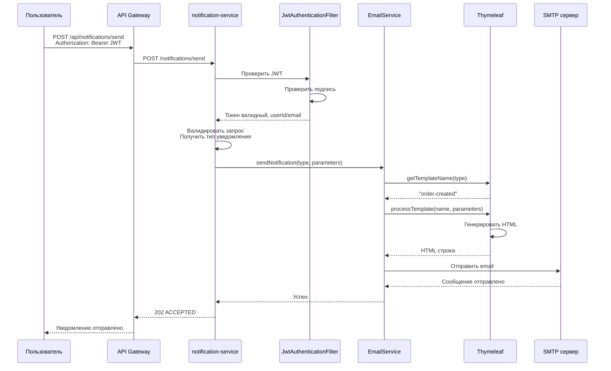
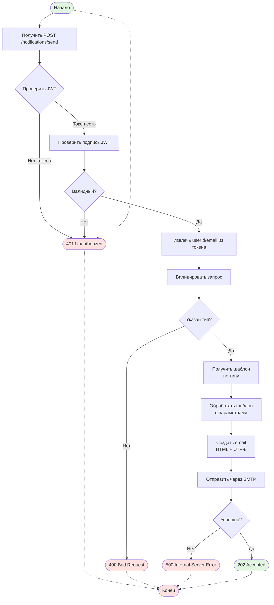
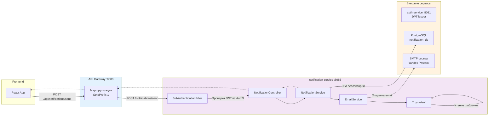
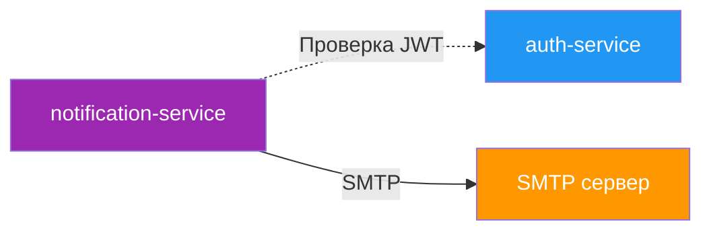

# notification-service

Сервис для отправки email-уведомлений в микросервисной системе регистрации доменов.

## Описание

notification-service — это Spring Boot микросервис, который отвечает за отправку email-уведомлений пользователям системы. Сервис использует Thymeleaf шаблоны для генерации HTML-писем и отправляет их через SMTP (по умолчанию Yandex Postbox Cloud). Также сервис хранит настройки пользователя для предупреждений о сроке действия доменов.

## Основные функции

- Отправка email-уведомлений различных типов (заказы, платежи, домены, верификация)
- Использование HTML-шаблонов для форматирования писем
- Хранение пользовательских предпочтений для уведомлений о сроке действия доменов
- Автоматическое отслеживание доменов у пользователей
- JWT-аутентификация для защищённых эндпоинтов
- Автоматическое выполнение миграций базы данных через Liquibase

## Технологический стек

- **Java 17**
- **Spring Boot 3.2.0**
- **Spring Mail** — отправка email через SMTP
- **Thymeleaf** — шаблонизация email-сообщений
- **Spring Data JPA** — работа с базой данных
- **Liquibase** — управление миграциями
- **PostgreSQL** — база данных
- **HikariCP** — пул соединений к БД
- **Spring Security** — защита JWT-аутентификацией
- **Lombok** — сокращение бойлерплейта

## Структура проекта

```
notification-service/
├── config/                    # Конфигурация бинов Spring
│   ├── JwtConfig.java         # Конфигурация JWT
│   ├── RestTemplateConfig.java # Настройка HTTP клиента
│   └── SecurityConfig.java    # Spring Security + JWT фильтр
├── controller/                # REST контроллеры
│   ├── NotificationController.java        # Отправка уведомлений
│   ├── NotificationPreferencesController.java  # Настройки уведомлений (TODO)
│   └── DomainExpiryController.java       # Отслеживание сроков (TODO)
├── security/                  # Слой безопасности
│   ├── JwtAuthenticationFilter.java
│   └── UserInfo.java          # Обёртка для Principal пользователя
├── service/                   # Бизнес-логика
│   ├── NotificationService.java
│   ├── EmailService.java      # SMTP отправка писем
│   ├── EmailTemplateService.java  # Обработка Thymeleaf шаблонов
│   └── EmailSendingException.java
├── dto/                       # DTO запросов/ответов
├── exception/                 # Обработка ошибок
│   └── EmailSendingExceptionHandler.java
├── util/                      # Утилиты
│   └── SecurityUtil.java      # Хелперы для SecurityContext
└── templates/emails/          # HTML шаблоны писем
```

## Конфигурация

| Параметр | Описание | По умолчанию |
|----------|----------|--------------|
| `server.port` | Порт сервиса | 8085 |
| `JWT_SECRET` | Ключ для подписи JWT токенов (>${DB_USER:***REMOVED***}32 символов) | - |
| `MAIL_HOST` | SMTP хост | postbox.cloud.yandex.net |
| `MAIL_PORT` | SMTP порт | 587 |
| `MAIL_USERNAME` | Логин для SMTP | - |
| `MAIL_PASSWORD` | Пароль для SMTP | - |
| `MAIL_FROM` | Email отправителя | noreply@hrofors.ru |
| `spring.datasource.url` | URL базы данных | jdbc:***REMOVED***ql://localhost:5432/notification_db |
| `services.auth.url` | URL auth-service | http://localhost:8081 |

## API Endpoints

| Метод | Эндпоинт | Описание | Требуется роль |
|-------|----------|----------|----------------|
| POST | `/notifications/send` | Отправить уведомление | USER |
| GET | `/notifications/health` | Проверка здоровья сервиса | Нет |
| GET | `/notifications/preferences` | Получить настройки уведомлений | USER (TODO) |
| PUT | `/notifications/preferences` | Обновить настройки уведомлений | USER (TODO) |
| GET | `/notifications/expiry/alerts` | Получить настройки предупреждений | USER (TODO) |
| PUT | `/notifications/expiry/alerts` | Обновить настройки предупреждений | USER (TODO) |
| GET | `/notifications/expiry/monitoring/domains` | Список отслеживаемых доменов | USER (TODO) |
| GET | `/notifications/expiry/monitoring/dashboard` | Статистика мониторинга | USER (TODO) |

### Отправка уведомления

**Запрос:**
```http
POST /notifications/send
Authorization: Bearer <jwt-token>
Content-Type: application/json

{
  "userId": "550e8400-e29b-41d4-a716-446655440000",
  "type": "ORDER_CREATED",
  "recipientEmail": "user@example.com",
  "subject": "Ваш заказ создан",
  "parameters": {
    "orderId": "12345",
    "totalAmount": "1000.00"
  }
}
```

**Ответ:**
```http
HTTP/1.1 202 ACCEPTED

{
  "success": true,
  "data": "Notification sent successfully",
  "timestamp": "2026-02-18T12:30:45Z"
}
```

## Типы уведомлений

| Тип | Шаблон | Тема по умолчанию |
|-----|--------|-------------------|
| `ORDER_CREATED` | `order-created` | "Заказ создан" |
| `PAYMENT_APPROVED` | `payment-approved` | "Платёж успешно обработан" |
| `DOMAIN_ACTIVATED` | `domain-activated` | "Домен активирован" |
| `DOMAIN_EXPIRING_SOON` | `domain-expiring-soon` | "Напоминание: срок действия домена истекает" |
| `DOMAIN_EXPIRED` | `domain-expired` | "Срок действия домена истёк" |
| `DOMAIN_RENEWED` | `domain-renewed` | "Домены продлены" |
| `EMAIL_VERIFICATION` | `email-verification` | "Подтверждение email адреса" |

## База данных

### Таблицы

#### `expiry_email_pref` — Настройки предупреждений о сроке действия

| Колонка | Тип | Описание |
|---------|-----|----------|
| `id` | UUID | Первичный ключ |
| `user_id` | UUID | ID пользователя |
| `days_before` | INTEGER | За сколько дней предупреждать |
| `enabled` | BOOLEAN | Включено ли предупреждение |
| `created_at` | TIMESTAMPTZ | Время создания |
| `updated_at` | TIMESTAMPTZ | Время обновления |

#### `domain_expiry_monitoring` — Отслеживание доменов

| Колонка | Тип | Описание |
|---------|-----|----------|
| `id` | UUID | Первичный ключ |
| `user_id` | UUID | ID владельца домена |
| `domain_id` | UUID | ID домена |
| `alert_days` | INTEGER | Период предупреждения в днях |
| `notified_at` | TIMESTAMPTZ | Время последнего уведомления |
| `created_at` | TIMESTAMPTZ | Время создания |
| `updated_at` | TIMESTAMPTZ | Время обновления |

## Диаграммы

### Sequence Diagram — Отправка уведомления



### BPMN Diagram — Процесс отправки уведомления



### BPMN Diagram — Поток запроса через систему



## Зависимости между сервисами



## Email шаблоны

Шаблоны расположены в `src/main/resources/templates/emails/`:

| Файл | Тип уведомления | Параметры |
|------|-----------------|-----------|
| `order-created.html` | ORDER_CREATED | `orderId`, `totalAmount` |
| `payment-approved.html` | PAYMENT_APPROVED | `orderId`, `amount`, `domainName` |
| `domain-activated.html` | DOMAIN_ACTIVATED | `domains` (список), `expiresAt` |
| `domain-expiring-soon.html` | DOMAIN_EXPIRING_SOON | `domainName`, `expiresAt`, `daysLeft` |
| `domain-expired.html` | DOMAIN_EXPIRED | `domainName`, `expiresAt` |
| `domain-renewed.html` | DOMAIN_RENEWED | `domains` (map domain->newExpiry) |
| `email-verification.html` | EMAIL_VERIFICATION | `verificationLink` |

Все шаблоны на русском языке с HTML форматированием и inline стилями.

## Security

- JWT токены проверяются через `JwtUtil` из модуля `common`
- Публичные эндпоинты: `/actuator/**`, `/health`, `/notifications/health`
- Все остальные эндпоинты требуют JWT-аутентификацию
- Из JWT извлекаются: `userId`, `email`, `isAdmin`
- Пользователям присваиваются роли: `ROLE_USER` и (опционально) `ROLE_ADMIN`

## Мониторинг

Actuator эндпоинты:
- `/actuator/health` — состояние сервиса
- `/actuator/info` — информация о сервисе
- `/actuator/metrics` — метрики приложения

## OpenAPI

Спецификация API доступна в `openapi.json` и описывает все эндпоинты сервиса.

## TODO

Следующие эндпоинты имеют заглушечную реализацию и требуют доработки:

- `GET/PUT /notifications/preferences` — Настройки уведомлений
- `GET/PUT /notifications/expiry/alerts` — Настройки предупреждений о сроке действия
- `GET /notifications/expiry/monitoring/domains` — Список отслеживаемых доменов
- `GET /notifications/expiry/monitoring/dashboard` — Статистика мониторинга

Эти эндпоинты должны использовать таблицы `expiry_email_pref` и `domain_expiry_monitoring` для хранения и получения данных.
