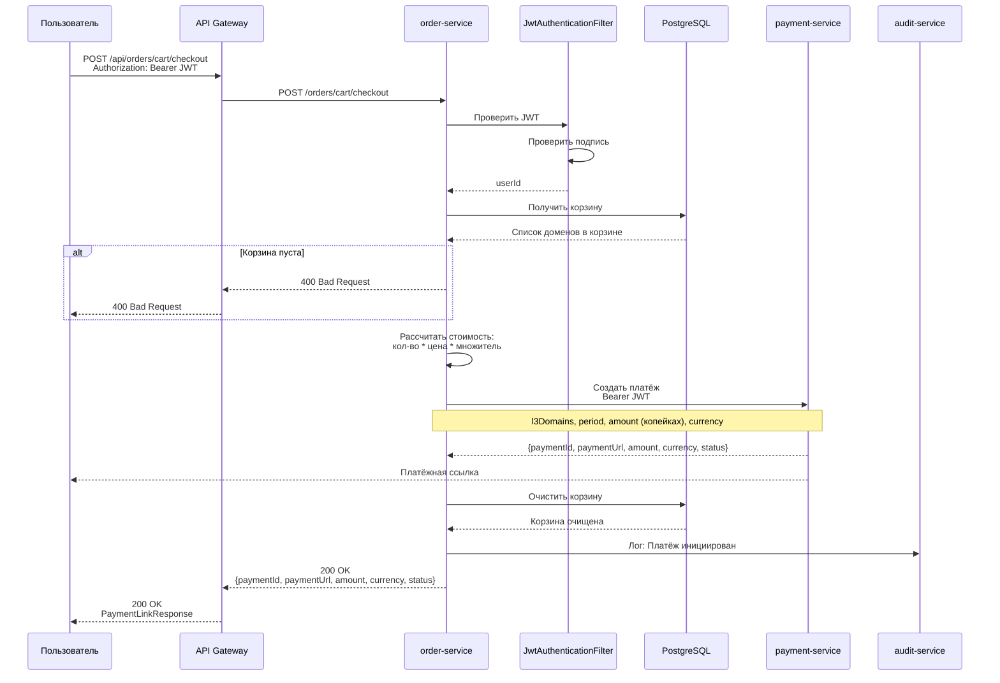
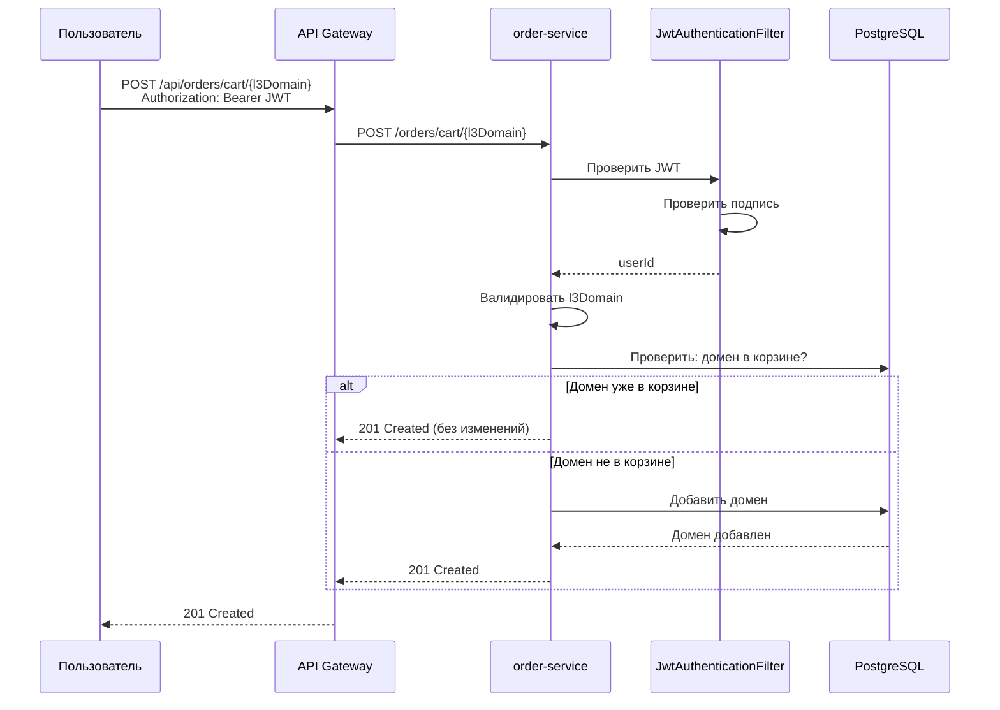
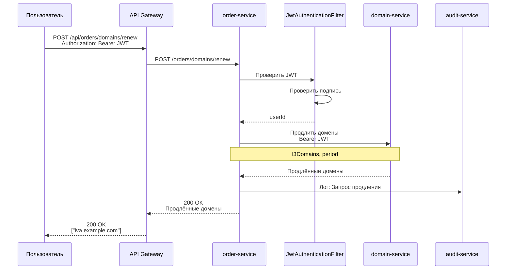
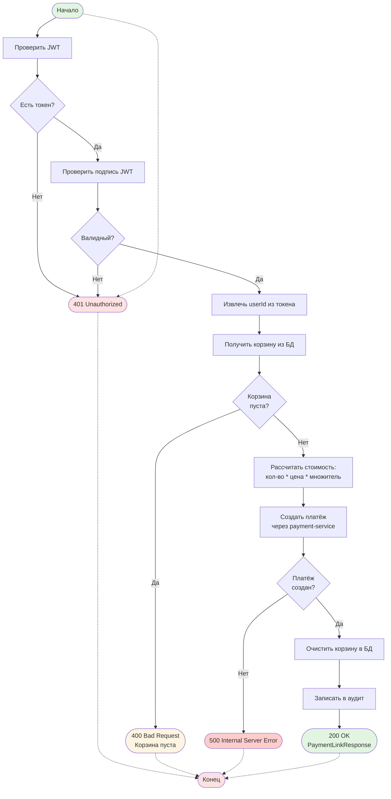
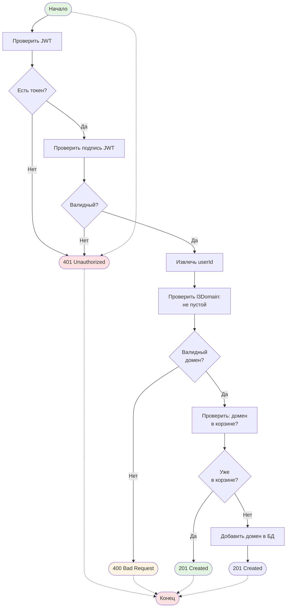
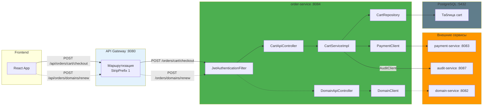
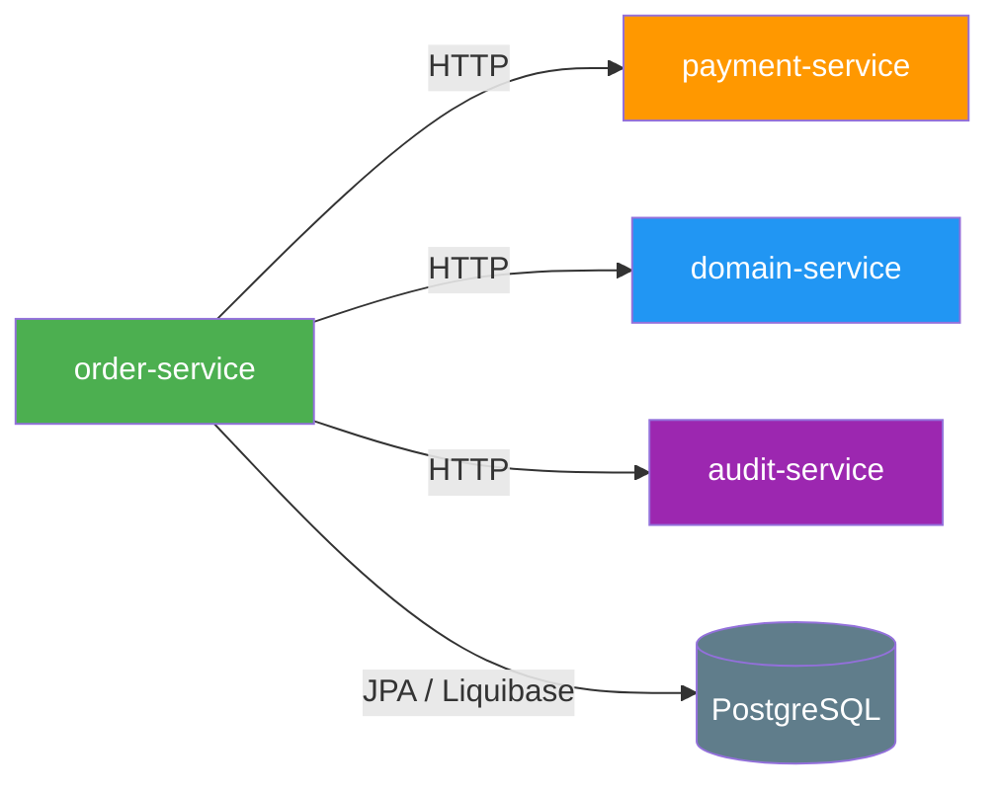
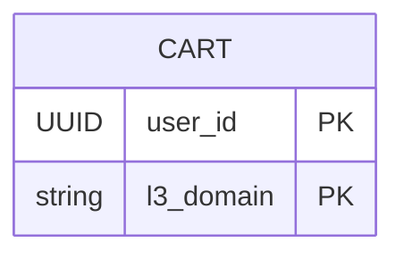

# order-service

Сервис для управления корзиной и оформления заказов в микросервисной системе регистрации доменов.

## Описание

order-service — это Spring Boot микросервис, который управляет корзиной доменов пользователя, рассчитывает стоимости и инициирует оплаты через интеграцию с payment-service. Сервис хранит состояние корзины в PostgreSQL базе данных и взаимодействует с другими сервисами через REST API.

## Основные функции

- Добавление L3-доменов в корзину пользователя
- Просмотр текущей корзины с расчётом стоимостей (месячная и годовая)
- Оформление заказа с выбором периода (MONTH/YEAR)
- Инициирование платежа через payment-service
- Продление сроков действия доменов
- Логирование действий в audit-service
- Защита всех операций JWT-аутентификацией

## Технологический стек

- **Java 17**
- **Spring Boot 3.2.0**
- **PostgreSQL** — хранение данных корзины
- **Liquibase** — миграции базы данных
- **OpenAPI Generator** — генерация API интерфейсов из YAML спецификации
- **Spring Security** — защита JWT-аутентификацией
- **HikariCP** — пул соединений к базе данных
- **Lombok** — сокращение бойлерплейта

## Структура проекта

```
order-service/
├── config/                    # Конфигурация бинов Spring
│   ├── AuditConfig.java       # Конфигурация AuditClient
│   ├── DomainClientConfig.java # Настройка DomainClient
│   ├── JwtConfig.java         # Конфигурация JWT
│   ├── OpenApiConfig.java     # Настройка Swagger/OpenAPI
│   ├── PaymentClientConfig.java # Настройка PaymentClient
│   └── SecurityConfig.java    # Spring Security + JWT фильтр
├── controller/                # REST контроллеры
│   ├── CartApiController.java    # Операции с корзиной
│   └── DomainApiController.java  # Операции с доменами (продление)
├── service/                   # Бизнес-логика
│   ├── CartService.java
│   └── impl/CartServiceImpl.java
├── client/                    # Клиенты для других сервисов
│   ├── DomainClient.java         # Клиент domain-service
│   ├── DomainClientException.java
│   ├── DomainClientProperties.java
│   ├── PaymentClient.java        # Клиент payment-service
│   ├── PaymentClientException.java
│   ├── PaymentClientProperties.java
│   ├── PaymentCreateRequest.java
│   └── PaymentCreateResponse.java
├── entity/                    # Сущности JPA
│   ├── Cart.java               # Сущность корзины
│   └── CartId.java             # Составной первичный ключ
├── repository/                # Репозитории JPA
│   └── CartRepository.java
├── security/                  # Слой безопасности
│   └── JwtAuthenticationFilter.java
└── resources/
    ├── db/changelog/           # Liquibase миграции
    ├── static/
    │   └── openapi.yaml        # Спецификация OpenAPI
    └── application.yml         # Конфигурация приложения
```

## Конфигурация

| Параметр | Описание | По умолчанию |
|----------|----------|--------------|
| `server.port` | Порт сервиса | 8084 |
| `JWT_SECRET` | Ключ для подписи JWT токенов | - |
| `DOMAIN_MONTHLY_PRICE` | Базовая цена домена за месяц (руб.) | 200 |
| `DOMAIN_YEARLY_DISCOUNT` | Коэффициент скидки за год | 0.7 |
| `DOMAIN_SERVICE_URL` | Базовый URL domain-service | http://localhost:8082 |
| `PAYMENT_SERVICE_URL` | Базовый URL payment-service | http://localhost:8083 |
| `AUDIT_SERVICE_URL` | Базовый URL audit-service | http://localhost:8087 |

### База данных

| Параметр | Описание | По умолчанию |
|----------|----------|--------------|
| `spring.datasource.url` | URL подключения к PostgreSQL | jdbc:***REMOVED***ql://localhost:5432/order_db |
| `spring.datasource.username` | Имя пользователя БД | ***REMOVED*** |
| `spring.datasource.password` | Пароль БД | ***REMOVED*** |
| `spring.datasource.hikari.minimum-idle` | Мин. размер пула соединений | 2 |
| `spring.datasource.hikari.maximum-pool-size` | Макс. размер пула соединений | 10 |

## API Endpoints

| Метод | Эндпоинт | Описание | Требуется роль |
|-------|----------|----------|----------------|
| GET | `/orders/cart/me` | Получить корзину текущего пользователя | Аутентификация |
| POST | `/orders/cart/{l3Domain}` | Добавить домен в корзину | Аутентификация |
| POST | `/orders/cart/checkout` | Оформить заказ (создать платёж) | Аутентификация |
| POST | `/orders/domains/renew` | Продлить домены | Аутентификация |

### Получение корзины

**Запрос:**
```http
GET /orders/cart/me
Authorization: Bearer <jwt-token>
```

**Ответ:**
```json
{
  "totalMonthlyPrice": 600,
  "totalYearlyPrice": 5040,
  "l3Domains": ["iva.example.com", "ivan.example.com", "test.example.com"]
}
```

### Добавление домена в корзину

**Запрос:**
```http
POST /orders/cart/iva.example.com
Authorization: Bearer <jwt-token>
```

**Ответ:** `201 Created`

### Оформление заказа

**Запрос:**
```http
POST /orders/cart/checkout
Authorization: Bearer <jwt-token>
Content-Type: application/json

{
  "period": "MONTH"
}
```

**Ответ:**
```json
{
  "paymentId": "550e8400-e29b-41d4-a716-446655440000",
  "paymentUrl": "https://payment.example.com/pay/550e8400-e29b-41d4-a716-446655440000",
  "amount": 60000,
  "currency": "RUB",
  "status": "PENDING"
}
```

### Продление доменов

**Запрос:**
```http
POST /orders/domains/renew
Authorization: Bearer <jwt-token>
Content-Type: application/json

{
  "l3Domains": ["iva.example.com"],
  "period": "YEAR"
}
```

**Ответ:** `["iva.example.com"]`

## Диаграммы

### Sequence Diagram — Оформление заказа



### Sequence Diagram — Добавление домена в корзину



### Sequence Diagram — Продление доменов



### BPMN Diagram — Процесс оформления заказа



### BPMN Diagram — Добавление домена в корзину



### BPMN Diagram — Поток запроса через API Gateway



### BPMN Diagram — Расчёт стоимости заказа

```mermaid
flowchart TD
    Start([Получены данные корзины]) --> CountDomain[Подсчитать домены]

    CountDomain --> monthlyPrice[Читать конфигурацию:<br/>DOMAIN_MONTHLY_PRICE]

    monthlyPrice --> yearlyDiscount[Читать конфигурацию:<br/>DOMAIN_YEARLY_DISCOUNT]

    yearlyDiscount --> GetPeriod[Получить период из запроса]

    GetPeriod --> CheckPeriod{Период?}

    CheckPeriod -- MONTH --> CalcMonthly[amount ${DB_USER:***REMOVED***} count * monthlyPrice * 100]

    CheckPeriod -- YEAR --> CalcYearlyStep1[yearlyFull ${DB_USER:***REMOVED***} count * monthlyPrice * 12]
    CalcYearlyStep1 --> CalcYearly[amount ${DB_USER:***REMOVED***} yearlyFull * yearlyDiscount * 100]

    CalcMonthly --> CreateRequest[Создать запрос на платёж:<br/>l3Domains, period, amount, RUB]
    CalcYearly --> CreateRequest

    CreateRequest --> PaymentClient[Вызвать paymentClient.createPayment]

    PaymentClient --> End1([Отправить запрос в payment-service])


    style Start fill:#e1f5e1
    style End1 fill:#e1f5e1
    style CalcMonthly fill:#fff3e0
    style CalcYearly fill:#fff3e0
    style CreateRequest fill:#e8f5e9
```

## Зависимости между сервисами



## Объёмная модель данных



**Таблица `cart`:**
- `user_id` — UUID пользователя (часть составного первичного ключа)
- `l3_domain` — имя L3-домена (часть составного первичного ключа, VARCHAR(255))

## Логирование

При выполнении операций сервис отправляет события аудита в audit-service:
- `"Payment initiated: {paymentId} (period${DB_USER:***REMOVED***}{period})"` — при инициации платежа
- `"Domain renewal requested: {count} domains (period${DB_USER:***REMOVED***}{period})"` — при запросе продления доменов

## Расчёт стоимости

### Параметры
- **DOMAIN_MONTHLY_PRICE** — базовая цена домена за месяц (по умолчанию: 200 руб.)
- **DOMAIN_YEARLY_DISCOUNT** — коэффициент скидки за год (по умолчанию: 0.7)

### Формулы
- **Месячная цена (несколько доменов):** `count * DOMAIN_MONTHLY_PRICE`
- **Годовая цена (один домен на год):** `(DOMAIN_MONTHLY_PRICE * 12) * DOMAIN_YEARLY_DISCOUNT`
- **Годовая цена (несколько доменов на год):** `(count * DOMAIN_MONTHLY_PRICE * 12) * DOMAIN_YEARLY_DISCOUNT`

### Примеры
- 1 домен на месяц: 200 руб.
- 3 домена на месяц: 600 руб.
- 1 домен на год: 200 * 12 * 0.7 ${DB_USER:***REMOVED***} 1680 руб.
- 3 домена на год: 600 * 12 * 0.7 ${DB_USER:***REMOVED***} 5040 руб.

## Security

- JWT токены проверяются через `JwtAuthenticationFilter`
- userId извлекается из токена и используется как principal
- Все эндпоинты требуют аутентификации (кроме `/actuator/**`, `/v3/api-docs/**`, `/swagger-ui/**`)
- JWT токен передаётся при интеграции с payment-service и domain-service

## Мониторинг

Actuator эндпоинты:
- `/actuator/health` — состояние сервиса
- `/actuator/info` — информация о сервисе
- `/actuator/metrics` — метрики приложения

## Swagger UI

Документация API доступна по адресу: `http://localhost:8084/swagger-ui.html`

## Миграции базы данных

Liquibase changelog находится в `src/main/resources/db/changelog/`:
- `001-initial.sql` — создание таблицы `cart`

Миграции применяются автоматически при запуске приложения.
