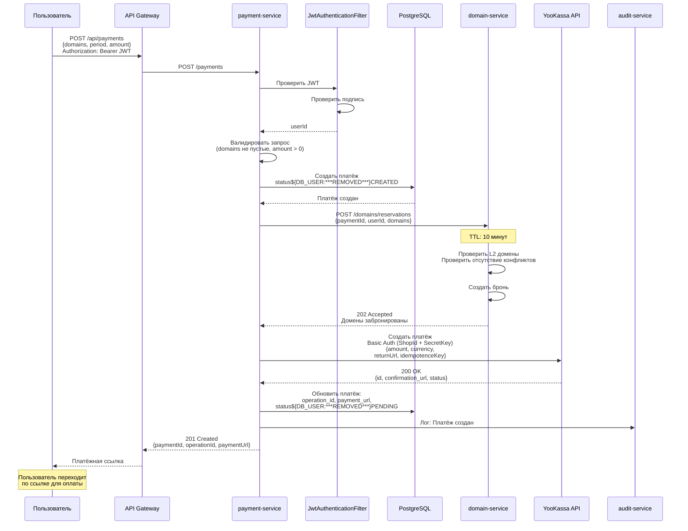
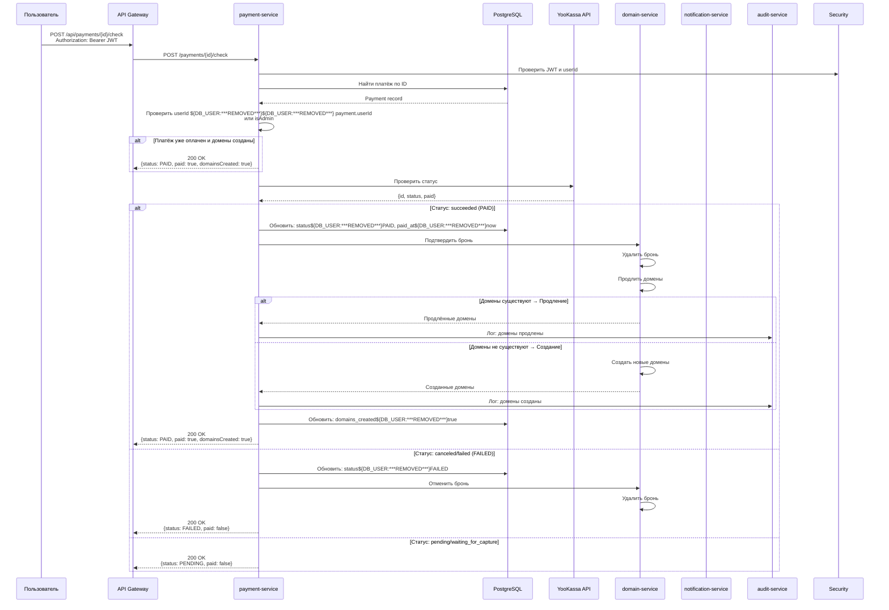
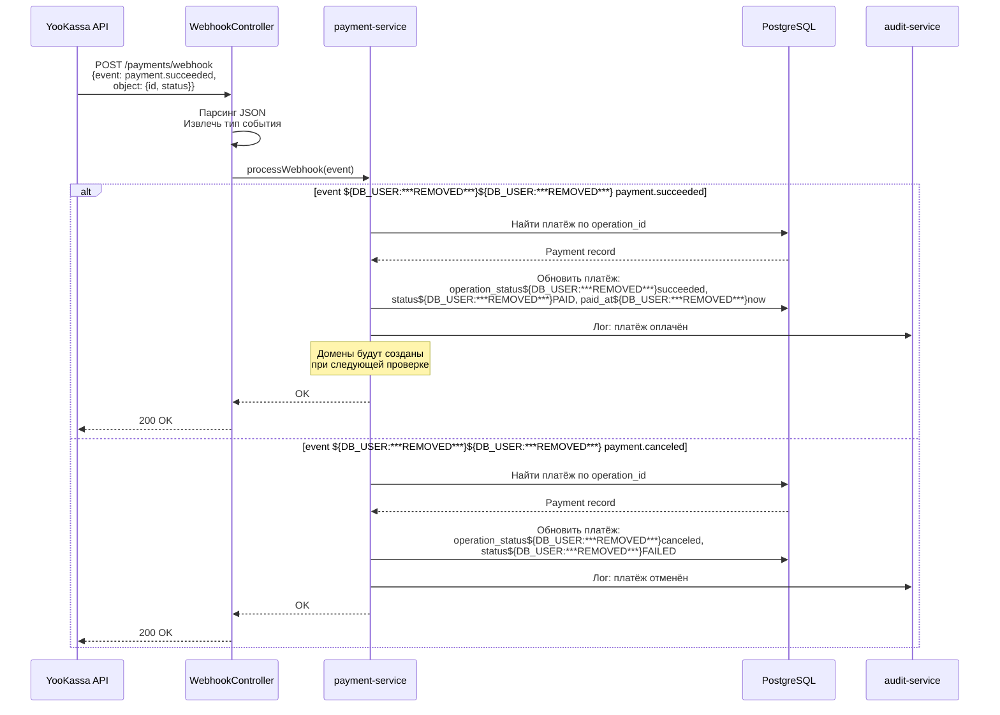
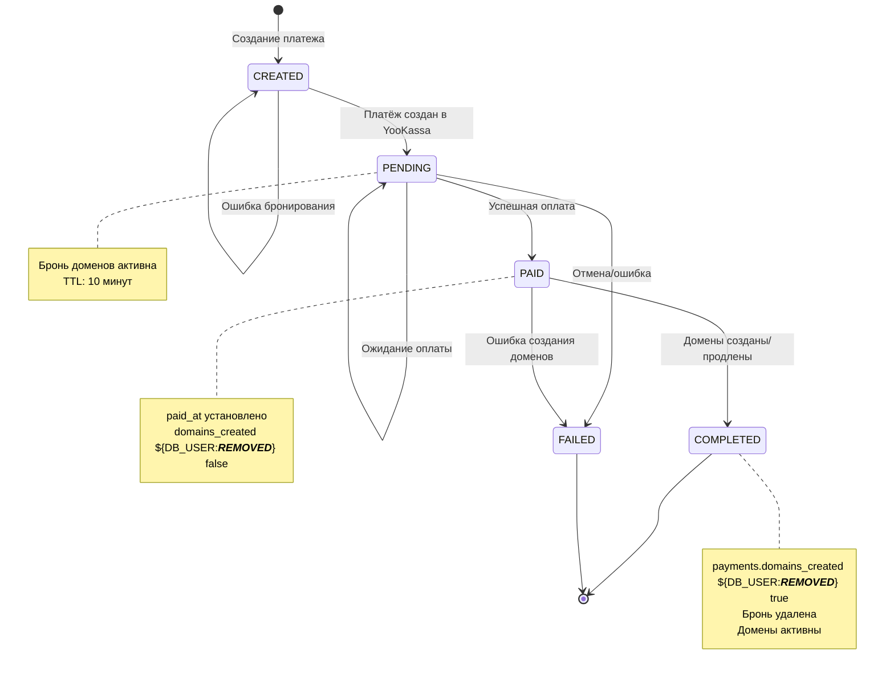
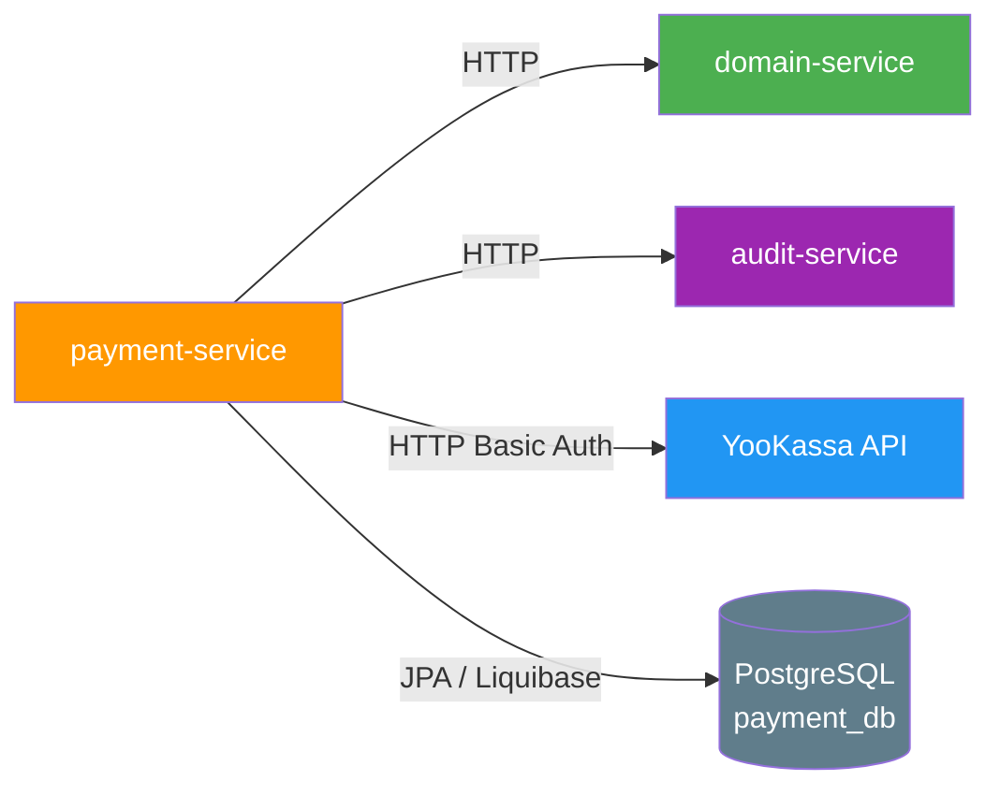

# payment-service

Сервис для обработки платежей в микросервисной системе регистрации доменов.

## Описание

payment-service — это Spring Boot микросервис, который отвечает за обработку платежей через платёжный шлюз YooKassa, бронирование доменов на время оплаты и завершение регистрации доменов после успешной оплаты.

## Основные функции

- Создание платёжных ссылок через YooKassa
- Бронирование доменов на время оплаты (TTL 10 минут)
- Отслеживание статуса платежа
- Обработка вебхуков от YooKassa
- Завершение регистрации доменов после успешной оплаты
- Продление доменов при повторной оплате
- Отмена брони при неудачной оплате
- Логирование действий в audit-service

## Технологический стек

- **Java 17**
- **Spring Boot 3.2.0**
- **Spring Data JPA** — работа с базой данных
- **PostgreSQL** — база данных платежей
- **Liquibase** — миграции базы данных
- **Spring Security** — защита JWT-аутентификацией
- **YooKassa API** — платёжный шлюз
- **OpenAPI Generator** — генерация API интерфейсов из YAML спецификации
- **Lombok** — сокращение бойлерплейта
- **HikariCP** — пул соединений к БД

## Структура проекта

```
payment-service/
├── config/                    # Конфигурация бинов Spring
│   ├── AuditConfig.java       # Конфигурация AuditClient
│   ├── ClientConfig.java      # Настройка RestTemplate
│   ├── JwtConfig.java         # Конфигурация JWT
│   ├── OpenApiConfig.java     # Настройка Swagger/OpenAPI
│   └── SecurityConfig.java    # Spring Security + JWT фильтр
├── controller/                # REST контроллеры
│   ├── PaymentApiController.java    # Создание и проверка платежей
│   └── YooKassaWebhookController.java # Вебхуки от YooKassa
├── service/                   # Бизнес-логика
│   ├── PaymentService.java
│   └── impl/PaymentServiceImpl.java
├── entity/                    # JPA сущности
│   ├── Payment.java           # Платёж
│   └── PaymentStatus.java     # Статус платежа (enum)
├── repository/                # Spring Data JPA репозитории
│   └── PaymentRepository.java
├── client/                    # Клиенты для внешних сервисов
│   ├── DomainClient.java      # Клиент domain-service
│   ├── DomainClientProperties.java
│   ├── DomainClientException.java
│   ├── YooKassaClient.java    # Клиент YooKassa
│   ├── YooKassaClientProperties.java
│   └── YooKassaClientException.java
├── security/                  # Слой безопасности
│   └── JwtAuthenticationFilter.java
└── util/
    └── SecurityUtil.java      # Утилиты для работы с SecurityContext
```

## База данных

### Таблица `payment`

| Колонка | Тип | Nullable | Описание |
|---------|-----|----------|----------|
| `id` | UUID | NO | Первичный ключ |
| `user_id` | UUID | NO | ID пользователя |
| `period` | VARCHAR(16) | NO | Период подписки (MONTH/YEAR) |
| `amount` | INTEGER | NO | Сумма в минимальных единицах (копейках) |
| `currency` | VARCHAR(8) | NO | Код валюты (RUB) |
| `status` | VARCHAR(32) | NO | Статус платежа |
| `operation_id` | VARCHAR(128) | YES | ID платежа в YooKassa |
| `payment_url` | VARCHAR(1024) | YES | Ссылка на оплату |
| `operation_status` | VARCHAR(64) | YES | Исходный статус YooKassa |
| `domains_created` | BOOLEAN | NO | Созданы ли домены (по умолчанию false) |
| `created_at` | TIMESTAMPTZ | NO | Время создания |
| `updated_at` | TIMESTAMPTZ | YES | Время обновления |
| `paid_at` | TIMESTAMPTZ | YES | Время оплаты |

### Таблица `payment_domains`

| Колонка | Тип | Описание |
|---------|-----|----------|
| `payment_id` | UUID (FK) | ID платежа |
| `l3_domain` | VARCHAR(255) | L3 домен |

**Индексы:**
- `idx_payment_user_id` — для поиска платежей пользователя
- `idx_payment_operation_id` — для поиска по ID YooKassa

## API Endpoints

| Метод | Эндпоинт | Описание | Требуется роль |
|-------|----------|----------|----------------|
| POST | `/payments` | Создание платежа | Аутентификация |
| POST | `/payments/{paymentId}/check` | Проверка статуса платежа | Аутентификация (только свои) |
| POST | `/payments/webhook` | Вебхук от YooKassa | Нет |

### Создание платежа

**Запрос:**
```http
POST /payments
Authorization: Bearer <jwt-token>
Content-Type: application/json

{
  "l3Domains": ["iva.example.com", "test.example.com"],
  "period": "YEAR",
  "amount": 10000,
  "currency": "RUB",
  "description": "Optional description"
}
```

**Ответ:**
```json
{
  "paymentId": "550e8400-e29b-41d4-a716-446655440000",
  "operationId": "yookassa-payment-id",
  "paymentUrl": "https://payment-url...",
  "status": "PENDING",
  "amount": 10000,
  "currency": "RUB"
}
```

### Проверка статуса платежа

**Запрос:**
```http
POST /payments/{paymentId}/check
Authorization: Bearer <jwt-token>
```

**Ответ:**
```json
{
  "paymentId": "550e8400-e29b-41d4-a716-446655440000",
  "status": "PAID",
  "paid": true,
  "domainsCreated": true,
  "operationStatus": "succeeded",
  "paymentUrl": "https://payment-url...",
  "amount": 10000,
  "currency": "RUB"
}
```

## Статусы платежа

| Статус | Описание |
|--------|----------|
| `CREATED` | Платёж создан |
| `PENDING` | Ожидает оплаты |
| `PAID` | Оплачено |
| `FAILED` | Ошибка оплаты |

## Диаграммы

### Sequence Diagram — Создание платежа



### Sequence Diagram — Проверка статуса платежа



### Sequence Diagram — Вебхук от YooKassa



### BPMN Diagram — Процесс создания платежа

```mermaid
flowchart TD
    Start([Начало]) --> CheckAuth[Проверить JWT]

    CheckAuth --> HasToken{Есть токен?}
    HasToken -- Нет --> Return401([401 Unauthorized])
    HasToken -- Да --> Validate[Проверить подпись JWT]

    Validate --> IsValid{Валидный?}
    IsValid -- Нет --> Return401([401 Unauthorized])
    IsValid -- Да --> GetUserId[Извлечь userId]

    GetUserId --> ValidateRequest[Валидировать запрос<br/>domains не пустые, amount > 0]

    ValidateRequest --> ValidReq{Данные<br/>валидны?}
    ValidReq -- Нет --> Return400([400 Bad Request])
    ValidReq -- Да --> CreatePayment[Создать платёж в БД<br/>status${DB_USER:***REMOVED***}CREATED]

    CreatePayment --> Reserve[Забронировать домены<br/>TTL 10 мин]

    Reserve --> Reserved{Бронь<br/>создана?}
    Reserved -- Нет --> Return502([502 Bad Gateway<br/>Ошибка domain-service])
    Reserved -- Да --> CreateYooKassa[Создать платёж YooKassa<br/>idempotenceKey ${DB_USER:***REMOVED***} paymentId]

    CreateYooKassa --> YooKassaCreated{Платёж<br/>создан?}
    YooKassaCreated -- Нет --> Return500([500 Internal Server Error<br/>Ошибка YooKassa])
    YooKassaCreated -- Да --> UpdatePayment[Обновить платёж:<br/>operation_id, payment_url, status${DB_USER:***REMOVED***}PENDING]

    UpdatePayment --> LogAudit[Записать в аудит<br/>Payment created]

    LogAudit --> Return201([201 Created<br/>paymentUrl])

    Start -.-> Return401
    Return401 -.-> End([Конец])
    Return400 -.-> End
    Return502 -.-> End
    Return500 -.-> End
    Return201 -.-> End

    style Start fill:#e1f5e1
    style End fill:#fce1e1
    style Return201 fill:#a5d6a7
    style Return401 fill:#ef9a9a
    style Return400 fill:#fff4e1
    style Return500 fill:#ffcccc
    style Return502 fill:#ffe0b2
```

### BPMN Diagram — Процесс обработки успешной оплаты

```mermaid
flowchart TD
    Start([Платёж оплачен<br/>YooKassa webhook]) --> FindPayment[Найти платёж по operation_id]

    FindPayment --> PaymentFound{Платёж<br/>найден?}
    PaymentFound -- Нет --> Return404([404 Not Found])
    PaymentFound -- Да --> AlreadyProcessed{Статус<br/>PAID?}

    AlreadyProcessed -- Да --> CheckDomains{Domains<br/>created?}
    CheckDomains -- Да --> Return200([200 OK<br/>Уже обработано])

    AlreadyProcessed -- Нет --> CancelReservation[Отменить бронь]

    CancelReservation --> TryRenew[Попытка продления<br/>POST /domains/userDomains/renew]

    TryRenew --> RenewSuccess{Продление<br/>успешно?}
    RenewSuccess -- Да --> LogRenew[Лог: продлено]
    RenewSuccess -- Нет --> CreateDomains[Создать домены]

    LogRenew --> UpdateStatus[UPDATE payment<br/>status${DB_USER:***REMOVED***}PAID, paid_at${DB_USER:***REMOVED***}now]
    CreateDomains --> DomainsCreated{Создано<br/>успешно?}

    DomainsCreated -- Да --> LogCreate[Лог: создано]
    DomainsCreated -- Нет --> Return500([500 Internal Server Error])

    LogCreate --> UpdateStatus

    UpdateStatus --> LogSuccess[Лог: платёж успешен]

    LogSuccess --> Return200_2([200 OK])

    Start -.-> Return404
    Return404 -.-> End([Конец])
    CheckDomains --> Return200
    Return500 -.-> End
    Return200 -.-> End
    Return200_2 -.-> End

    style Start fill:#e1f5e1
    style End fill:#fce1e1
    style Return200 fill:#a5d6a7
    style Return404 fill:#ef9a9a
    style Return500 fill:#ffcccc
```

### BPMN Diagram — Жизненный цикл платежа



## Зависимости между сервисами



## Логирование

### Аудит события

Сервис отправляет события аудита в audit-service:

- `"Payment created: {paymentId} for domains: {domains}"` — при создании платежа
- `"Payment failed: {paymentId}, domain reservation cancelled"` — при неудачной оплате
- `"Domains renewed after payment: {paymentId}, domains: {domains}"` — при продлении доменов
- `"Domains created after payment: {paymentId}, domains: {domains}"` — при создании доменов
- `"Webhook: payment succeeded: {operationId}"` — при получении вебхука об успехе
- `"Webhook: payment canceled: {operationId}"` — при получении вебхука об отмене

## YooKassa интеграция

### Конфигурация

Платёжный шлюз YooKassa требует следующие параметры:

| Параметр | Описание |
|----------|----------|
| `YOOKASSA_CLIENT_SHOP_ID` | ID магазина в YooKassa |
| `YOOKASSA_CLIENT_SECRET_KEY` | Секретный ключ магазина |
| `YOOKASSA_CLIENT_RETURN_URL` | URL возврата после оплаты |

### Характеристики платёжной ссылки

- **Idempotence key**: ID платежа в БДА — предотвращает duplicat-ы
- **Return URL**: пользователь возвращается на фронтенд после оплаты
- **Описание**: префикс + список доменов
- **Валюта**: RUB (по умолчанию)
- **Сумма**: в минимальных единицах (копейках)

### Вебхуки

YooKassa отправляет уведомления на эндпоинт `/payments/webhook`:

- `payment.succeeded` — платёж успешно завершён
- `payment.canceled` — платёж отменён

## Security

- JWT токены проверяются через `JwtUtil` из модуля `common`
- Пользователи могут проверять только свои платежи
- Администраторы могут проверять любые платежи
- Вебхук эндпоинт не требует аутентификации (безопасность через проверку operation_id)

## Мониторинг

Actuator эндпоинты:
- `/actuator/health` — состояние сервиса
- `/actuator/info` — информация о сервисе
- `/actuator/metrics` — метрики приложения

## Swagger UI

Документация API доступна по адресу: `http://localhost:8083/swagger-ui.html`

## Бронирование доменов

Домены бронируются на время оплаты для предотвращения гонок (race conditions):

- **ТTL**: 10 минут (по умолчанию)
- **Создание**: `POST /domains/reservations` при создании платежа
- **Подтверждение**: `POST /domains/reservations/{id}/confirm` при успешной оплате
- **Отмена**: `DELETE /domains/reservations/{id}` при неудачной оплате

## Обработка доменов после оплаты

После успешной оплаты сервис пытается:

1. **Продление доменов** — если домены уже существуют у пользователя
2. **Создание доменов** — если домены не существуют

Если оба варианта неудачны — платёж отмечается как успешный, но `domains_created ${DB_USER:***REMOVED***} false`.

## Обработка ошибок

Сервис обрабатывает следующие ошибки:

| Ошибка | HTTP статус | Обработка |
|--------|-------------|-----------|
| Отсутствует JWT | 401 | Возврат ошибки |
| Невалидный JWT | 401 | Возврат ошибки |
| Нет прав на платёж | 403 | Возврат ошибки |
| Валидация данных | 400 | Возврат ошибки |
| Domain service недоступен | 502 | Отмена брони |
| YooKassa ошибка | 500 | Отмена брони |
| Платёж не найден | 404 | Возврат ошибки |
